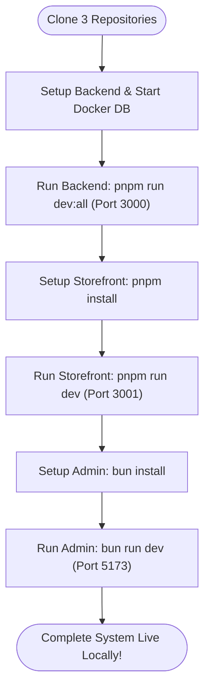
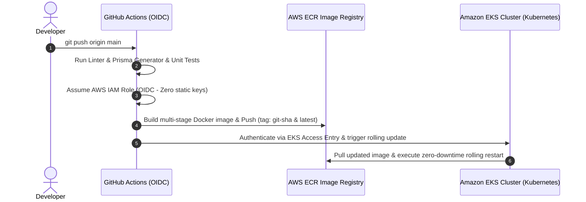

# Project: E-Commerce Microservices Platform (Backend, Customer Storefront & Admin Dashboard)

## Table of Contents
- [I. Introduction](#i-introduction)
  - [About this project](#about-this-project)
  - [Original Codebase & Architectural Enhancements](#original-codebase--architectural-enhancements)
- [II. System Overview](#ii-system-overview)
  - [1. Architecture Diagram](#1-architecture-diagram)
  - [2. Tech Stack](#2-tech-stack)
  - [3. Services Breakdown](#3-services-breakdown)
  - [4. The 4 Repositories](#4-the-4-repositories)
- [III. Prerequisites](#iii-prerequisites)
  - [Local Development Tools](#local-development-tools)
  - [Third-Party Services (Free Tiers)](#third-party-services-free-tiers)
- [IV. Step-by-Step Guide: Cloning & Running All Projects Locally](#iv-step-by-step-guide-cloning--running-all-projects-locally)
  - [1. Clone all 3 Repositories](#1-clone-all-3-repositories)
  - [2. Setup and Run Backend Microservices](#2-setup-and-run-backend-microservices)
  - [3. Setup and Run Customer Storefront](#3-setup-and-run-customer-storefront)
  - [4. Setup and Run Admin Dashboard](#4-setup-and-run-admin-dashboard)
- [V. External Integrations: Stripe, Clerk & AI Agent Setup](#v-external-integrations-stripe-clerk--ai-agent-setup)
  - [1. Stripe Payment Gateway & Webhook Setup](#1-stripe-payment-gateway--webhook-setup)
  - [2. User Management & Clerk Webhook Synchronization](#2-user-management--clerk-webhook-synchronization)
  - [3. AI Agent Architecture & Configuration](#3-ai-agent-architecture--configuration)
- [VI. Admin Portal Security (Cloudflare Zero Trust - Option 1)](#vi-admin-portal-security-cloudflare-zero-trust---option-1)
  - [Why Cloudflare Zero Trust?](#why-cloudflare-zero-trust)
  - [Step-by-Step Edge Protection Setup](#step-by-step-edge-protection-setup)
- [VII. Packaging Microservices & AI Agent (Docker)](#vii-packaging-microservices--ai-agent-docker)
- [VIII. CI/CD & Cloud Deployment Overview](#viii-cicd--cloud-deployment-overview)
  - [Automated Pipeline Workflow](#automated-pipeline-workflow)
  - [How to Update Code & Deploy](#how-to-update-code--deploy)
- [IX. Clean Up & Shutting Down All 3 Projects](#ix-clean-up--shutting-down-all-3-projects)
  - [1. Stop Dev Servers](#1-stop-dev-servers)
  - [2. Stop Local Database Containers](#2-stop-local-database-containers)
  - [3. Free Hanging Ports (Emergency Cleanup)](#3-free-hanging-ports-emergency-cleanup)

---

## I. Introduction

### About this project
This project is an enterprise-grade, full-stack **E-Commerce Microservices Platform** consisting of:
- **Event-driven Backend Microservices** built with **NestJS 11**, **gRPC (HTTP/2 Protocol Buffers)**, **PostgreSQL (Prisma ORM)**, and **Inngest**.
- **Customer Storefront** built with **Next.js 16 (App Router)**, **React 19**, **Tailwind CSS**, and **Three.js** interactive 3D hero canvas.
- **Admin Dashboard** built with **React 19**, **Vite**, **TypeScript**, and **TanStack Query** for real-time order/catalog management and KPI analytics.
- **AI Agent System** with a dedicated NestJS thread manager and Python FastAPI / LangGraph intelligent agent runtime.
- **Perimeter Edge Security** via **Cloudflare Zero Trust** preventing unauthorized public access to the admin portal at $0 cost.

---

### Original Codebase & Architectural Enhancements

> 🔗 **Original Reference Project:** [Jayce-Anh/shopping-cart-project](https://github.com/Jayce-Anh/shopping-cart-project) (adapted from [sivaprasadreddy/spring-boot-microservices-series](https://github.com/sivaprasadreddy/spring-boot-microservices-series.git)).

#### What was taken from the reference:
- The domain-driven service boundaries: splitting e-commerce responsibilities into distinct modules for **Catalog**, **Orders**, **Payments**, **Users**, and an **API Gateway**.
- The GitOps delivery philosophy utilizing container registries and continuous automated deployment.

#### What was improved and customized for this project:
1. **Modern High-Performance Stack**:
   - Replaced legacy Java 8 / Spring Boot with **NestJS 11 (TypeScript)**.
   - Replaced internal HTTP/REST calls with **gRPC (Protocol Buffers over HTTP/2)**, reducing inter-service latency to < 5ms and strictly enforcing type-safe contracts.
2. **Decoupled 3-Repository Architecture**:
   - Rather than bundling all components into a single monolithic codebase, the project is cleanly separated into 3 independent Git repositories (Backend, Customer Storefront, Admin Dashboard).
3. **Enterprise Authentication & Payments**:
   - Fully integrated **Clerk Authentication** with Role-Based Access Control (`AdminGuard`), ensuring customers cannot access admin operations.
   - Integrated **Stripe** payment elements, checkout sessions, and automated webhook processing (`POST /v1/payments/webhook/stripe`).
   - Integrated **Inngest** for durable, serverless background jobs (order processing, email dispatching).
4. **AI Assistant Layer**:
   - Implemented an intelligent AI agent runtime combining NestJS (`agent-service` on port 3010) with Python LangGraph (`agent-python` on port 8123) for product queries and order status assistance.
5. **Resolution of Hardcoded Vulnerabilities**:
   - Eliminated hardcoded AWS Account IDs (`701604998432`), static domains (`jayce-lab.works`), and static TargetGroup ARN hashes present in the reference repo.
6. **Zero-Friction Local Run**:
   - Added single-command runners (`pnpm run dev:all` and `pnpm run dev:all:with-agent`) that start all microservices, the API Gateway, and AI agents concurrently with color-coded logging and graceful teardown.
7. **Zero Trust Admin Security (Option 1)**:
   - Secured `admin.yourdomain.com` with Cloudflare Zero Trust email OTP protection instead of leaving the admin panel naked to public internet attacks.

---

## II. System Overview

### 1. Architecture Diagram

```
                                [ Public Internet ]
                                         │
                 ┌───────────────────────┴───────────────────────┐
                 │                                               │
      [ Customer Storefront ]                         [ Admin Dashboard ]
     (Next.js 16 - Port 3001)                      (React 19 / Vite - Port 5173)
                 │                                               │
                 │                                               ▼
                 │                                  ┌─────────────────────────┐
                 │                                  │  Cloudflare Zero Trust  │
                 │                                  │ (Email OTP / Secret Key)│
                 │                                  └────────────┬────────────┘
                 │                                               │
                 └───────────────────────┬───────────────────────┘
                                         │ HTTPS / REST
                                         ▼
                           ┌───────────────────────────┐
                           │    NestJS API Gateway     │
                           │  - Port 3000 (REST/JSON)  │
                           │  - Clerk Auth & RBAC Guard│
                           │  - Swagger at /docs       │
                           │  - Stripe & Clerk Webhooks│
                           └─────────────┬─────────────┘
                                         │
       ┌───────────────────┬─────────────┼─────────────┬───────────────────┐
       │ gRPC (5001)       │ gRPC (5002) │ gRPC (5003) │ gRPC (5004)       │ HTTP (3010)
       ▼                   ▼             ▼             ▼                   ▼
┌───────────────┐   ┌───────────────┐ ┌──────────────┐ ┌──────────────┐ ┌───────────────┐
│Catalog Service│   │ Order Service │ │Payment Serv. │ │Users Service │ │ Agent Service │
│  (Port 5001)  │   │  (Port 5002)  │ │ (Port 5003)  │ │ (Port 5004)  │ │  (Port 3010)  │
└───────┬───────┘   └───────┬───────┘ └──────┬───────┘ └──────┬───────┘ └───────┬───────┘
        │                   │                │                │                 │ HTTP
        │                   │                │                │                 ▼
        │                   │                │                │         ┌───────────────┐
        │                   │                │                │         │ Agent Python  │
        │                   │                │                │         │  (Port 8123)  │
        │                   │                │                │         │  (LangGraph)  │
        └───────────────────┴────────────────┼────────────────┘         └───────────────┘
                                             │
                                             ▼
                                ┌─────────────────────────┐
                                │  PostgreSQL (Port 5438) │
                                │   Redis (Port 6379)     │
                                └─────────────────────────┘
```

---

### 2. Tech Stack

| Component | Technologies |
| :--- | :--- |
| **Backend Monorepo** | NestJS 11, TypeScript, gRPC (@grpc/grpc-js), Prisma ORM, PostgreSQL, Redis, Inngest |
| **AI Agent Layer** | Python 3.12, FastAPI, LangGraph, LangChain, CopilotKit, AG-UI protocol |
| **Customer Storefront** | Next.js 16.2 (App Router, Turbopack), React 19, Tailwind CSS v4, Three.js, TanStack Query |
| **Admin Dashboard** | React 19, Vite, TypeScript, Tailwind CSS, Radix UI / Shadcn, TanStack Query |
| **Authentication & RBAC** | Clerk Authentication (`@clerk/express`, `@clerk/nextjs`, `@clerk/clerk-react`) |
| **Payments** | Stripe API & Stripe Elements (Webhooks, PaymentIntents) |
| **Security Perimeter** | Cloudflare Zero Trust (Access Application with Email OTP verification) |
| **Container & CI/CD** | Docker (Multi-stage builds), GitHub Actions (OIDC to AWS ECR & EKS Zero-Downtime Rollout) |

---

### 3. Services Breakdown

| Service | Protocol / Port | Local URL | Role & Description |
| :--- | :--- | :--- | :--- |
| **`api-gateway`** | HTTP `3000` | `http://localhost:3000` | REST API gateway, Clerk JWT verification, RBAC `AdminGuard`, Swagger docs at `/docs`. |
| **`catalog-service`**| gRPC `5001` | `localhost:5001` | Manages products, categories, stock counts, and pricing via Prisma. |
| **`order-service`** | gRPC `5002` | `localhost:5002` | Manages order creation, lifecycle state changes, and aggregated order KPI metrics. |
| **`payment-service`**| gRPC `5003` | `localhost:5003` | Interfaces with Stripe, manages transaction records, refunds, and revenue KPI metrics. |
| **`users-service`** | gRPC `5004` | `localhost:5004` | Synchronizes and manages customer accounts and administrator roles. |
| **`agent-service`** | HTTP `3010` | `http://localhost:3010` | NestJS AI thread manager, AG-UI protocol and session persistence. |
| **`agent-python`**  | HTTP `8123` | `http://localhost:8123` | Python FastAPI + LangGraph AI agent execution runtime. |
| **Customer Store** | HTTP `3001` | `http://localhost:3001` | Next.js 16 customer-facing shop with 3D canvas and online checkout. |
| **Admin Dashboard** | HTTP `5173` | `http://localhost:5173` | Backoffice portal with real-time KPI metrics, products CRUD, and order management. |

---

### 4. The 4 Repositories

The project is structured into four dedicated GitHub repositories:

| Repository | Tech Stack | Role & Link |
| :--- | :--- | :--- |
| **Backend Monorepo** (This repo) | NestJS 11, gRPC, PostgreSQL, Prisma, Inngest | RESTful API Gateway, gRPC microservices, Stripe & Clerk webhooks. <br>🔗 Repo: [`https://github.com/Hieuej147/ecommerce-backend.git`](https://github.com/Hieuej147/ecommerce-backend.git) |
| **Customer Storefront** | Next.js 16, React 19, Tailwind v4, Three.js | Customer shop, 3D interactive hero canvas, cart, Stripe checkout. <br>🔗 Repo: [`https://github.com/Hieuej147/-E-commerce.git`](https://github.com/Hieuej147/-E-commerce.git) |
| **Admin Dashboard** | React 19, Vite, TypeScript, Cloudflare Zero Trust | Backoffice management, real-time KPI metrics, orders & catalog CRUD. <br>🔗 Repo: [`https://github.com/Hieuej147/dashboard-admin-ecommern.git`](https://github.com/Hieuej147/dashboard-admin-ecommern.git) |
| **DevOps & GitOps (IaC & Manifests)** | Terraform, Helm, AWS EKS, AWS ECR, OIDC | Infrastructure as Code, OIDC authentication, 9 ECR registries, Kubernetes manifests. <br>🔗 Repo: [`https://github.com/Hieuej147/ecommerce-devops.git`](https://github.com/Hieuej147/ecommerce-devops.git) |

```
my-ecommerce/
├── backend/          # Repo 1: https://github.com/Hieuej147/ecommerce-backend.git
├── storefront/       # Repo 2: https://github.com/Hieuej147/-E-commerce.git
├── admin-dashboard/  # Repo 3: https://github.com/Hieuej147/dashboard-admin-ecommern.git
└── devops/           # Repo 4: https://github.com/Hieuej147/ecommerce-devops.git
```

---

## III. Prerequisites

### Local Development Tools
Make sure the following tools are installed on your machine:
- **Node.js**: `v20.x` or `v22.x` ([nodejs.org](https://nodejs.org/))
- **pnpm**: `v9.x` or `v10.x` (`npm install -g pnpm`)
- **Bun**: (Recommended for Admin Dashboard) (`curl -fsSL https://bun.sh/install | bash`)
- **Python**: `3.12+` (Required only if running `agent-python` locally outside Docker)
- **Docker & Docker Compose**: For running local PostgreSQL and Redis ([docker.com](https://www.docker.com/))
- **Git**: For cloning repositories ([git-scm.com](https://git-scm.com/))

### Third-Party Services (Free Tiers)
- **Clerk Account**: Free authentication provider ([clerk.com](https://clerk.com)). Provides your publishable key and secret key.
- **Stripe Account**: Free sandbox/test mode for payments ([stripe.com](https://stripe.com)).
- **Cloudflare Account**: (For production) Free tier includes Zero Trust protection for up to 50 users ([cloudflare.com](https://cloudflare.com)).

---

## IV. Step-by-Step Guide: Cloning & Running All 3 Projects Locally

Follow this complete step-by-step walkthrough to clone, configure, and launch the entire platform on your computer:



---

### 1. Clone all 3 Repositories
Create a parent workspace directory and clone the 3 repositories side-by-side:

```bash
# Create and enter workspace directory
mkdir my-ecommerce && cd my-ecommerce

# Clone Repo 1: Backend Monorepo
git clone https://github.com/Hieuej147/ecommerce-backend.git backend

# Clone Repo 2: Customer Storefront
git clone https://github.com/Hieuej147/-E-commerce.git storefront

# Clone Repo 3: Admin Dashboard
git clone https://github.com/Hieuej147/dashboard-admin-ecommern.git admin-dashboard

# Clone Repo 4: DevOps & GitOps Manifests
git clone https://github.com/Hieuej147/ecommerce-devops.git devops
```

---

### 2. Setup and Run Backend Microservices

Open **Terminal 1**:
```bash
cd backend

# 1. Install dependencies
pnpm install

# 2. Configure environment variables
cp .env.example .env

# 3. Start PostgreSQL (port 5438) and Redis (port 6379) via Docker
docker compose up -d

# 4. Generate Prisma clients and run database migrations
pnpm run db:setup

# 5. (Optional) Seed demo products and admin user
pnpm run db:seed:demo

# 6. Launch all 5 microservices & API Gateway concurrently:
pnpm run dev:all

# OR launch everything INCLUDING the AI Agent services (NestJS agent-service + Python agent):
# pnpm run dev:all:with-agent
```

✅ **Verification**:
- API Gateway is live at: `http://localhost:3000`
- Interactive Swagger API Documentation: [http://localhost:3000/docs](http://localhost:3000/docs)
- Catalog gRPC (`5001`), Order gRPC (`5002`), Payment gRPC (`5003`), Users gRPC (`5004`) are all operational.

---

### 3. Setup and Run Customer Storefront

Open **Terminal 2**:
```bash
cd storefront

# 1. Install dependencies
pnpm install

# 2. Configure environment variables
cp .env.example .env.local

# 3. Start Next.js development server
pnpm run dev
```

✅ **Verification**:
- Customer Storefront is live at: [http://localhost:3001](http://localhost:3001)
- You can browse products, interact with the 3D banner, add items to cart, and test checkout.

---

### 4. Setup and Run Admin Dashboard

Open **Terminal 3**:
```bash
cd admin-dashboard

# 1. Install dependencies
bun install
# (or: pnpm install)

# 2. Configure environment variables
cp .env.example .env

# 3. Start Vite development server
bun run dev
# (or: pnpm run dev)
```

✅ **Verification**:
- Admin Dashboard is live at: [http://localhost:5173](http://localhost:5173)
- Log in with your Clerk account. Real-time KPI cards for orders, payments, and product tables will render automatically.

---

## V. External Integrations: Stripe, Clerk & AI Agent Setup

### 1. Stripe Payment Gateway & Webhook Setup

The payment flow uses Stripe Checkout and PaymentIntents. When a payment succeeds, Stripe notifies the API Gateway via an asynchronous webhook to update the order fulfillment state.

#### A. Obtain Stripe API Keys
1. Sign up or log into [dashboard.stripe.com](https://dashboard.stripe.com) and switch to **Test mode**.
2. Go to **Developers** -> **API keys**.
3. Copy the **Secret key** (`sk_test_...`) and paste into `backend/.env`:
   ```env
   STRIPE_SECRET_KEY=sk_test_your_secret_key
   STRIPE_CURRENCY=usd
   ```

#### B. Setup Stripe Webhook Endpoint
The backend listens for Stripe webhooks at endpoint:
```
POST /v1/payments/webhook/stripe
```

**For Production:**
1. In the Stripe Dashboard, go to **Developers** -> **Webhooks** -> click **Add an endpoint**.
2. **Endpoint URL**: `https://api.yourdomain.com/v1/payments/webhook/stripe`
3. **Events to listen to**:
   - `payment_intent.succeeded`
   - `payment_intent.payment_failed`
   - `checkout.session.completed`
   - `charge.refunded`
4. Click **Add endpoint**.
5. Reveal the **Signing secret** (`whsec_...`) and paste it into `backend/.env`:
   ```env
   STRIPE_WEBHOOK_SECRET=whsec_your_stripe_webhook_signing_secret
   ```

**For Local Development Testing:**
Use the official [Stripe CLI](https://stripe.com/docs/stripe-cli) to forward events locally:
```bash
# Login to Stripe CLI
stripe login

# Forward webhook events to your local NestJS API Gateway
stripe listen --forward-to localhost:3000/v1/payments/webhook/stripe
```
The CLI will output: `> Ready! Your webhook signing secret is whsec_...`. Copy this secret into `backend/.env` under `STRIPE_WEBHOOK_SECRET`.

---

### 2. User Management & Clerk Webhook Synchronization

User accounts are authenticated via Clerk. To ensure that customer profiles and administrator accounts exist in the internal PostgreSQL database, Clerk sends webhook notifications on user lifecycle events.

#### A. Obtain Clerk API Keys
1. In the [Clerk Dashboard](https://dashboard.clerk.com), select your application.
2. Go to **Configure** -> **API Keys**.
3. Copy **Publishable Key**, **Secret Key**, and the **JWT Verification Key** into `backend/.env`:
   ```env
   CLERK_PUBLISHABLE_KEY=pk_test_...
   CLERK_SECRET_KEY=sk_test_...
   CLERK_JWT_KEY="-----BEGIN PUBLIC KEY-----\n...\n-----END PUBLIC KEY-----"
   CLERK_AUTHORIZED_PARTIES=http://localhost:3000,http://localhost:3001,http://localhost:5173
   ```

#### B. Setup Clerk Webhook for User Synchronization
The backend listens for Clerk webhooks at endpoint:
```
POST /v1/webhooks/clerk
```

1. In the Clerk Dashboard, go to **Configure** -> **Webhooks** -> click **Add Endpoint**.
2. **Endpoint URL**:
   - Production: `https://api.yourdomain.com/v1/webhooks/clerk`
   - Local: Use ngrok or local tunnel: `https://<your-tunnel>.ngrok-free.dev/v1/webhooks/clerk`
3. **Subscribe to events**:
   - `user.created`
   - `user.updated`
   - `user.deleted`
4. Click **Create**.
5. Copy the **Signing Secret** (`whsec_...`) and paste it into `backend/.env`:
   ```env
   CLERK_WEBHOOK_SIGNING_SECRET=whsec_your_clerk_webhook_signing_secret
   ```

#### C. Designating Administrator Roles
All newly registered users default to the `CUSTOMER` role. To grant an administrator access to the Admin Dashboard:
- **Method 1 (Clerk Dashboard)**: In Clerk Dashboard -> **Users** -> click on the user -> edit **Public metadata** -> enter `{"role": "admin"}`.
- **Method 2 (Database Seeder)**: Run `pnpm run db:seed:demo` in `backend/`, which automatically provisions demo admin accounts and catalog inventory in your local PostgreSQL database.

---

### 3. AI Agent Architecture & Configuration

The AI Assistant is divided into two layers:

1. **`agent-service` (NestJS on Port 3010)**:
   - Manages user conversation threads, session persistence, and AG-UI streaming protocol.
   - Connected to PostgreSQL via Prisma schema (`prisma.agent.config.ts`).
2. **`agent-python` (Python FastAPI on Port 8123)**:
   - Hosts the LangGraph graph with autonomous tools for querying products, checking orders, and answering customer questions.

#### Required Agent Configuration:
In `backend/.env` or `backend/agent-python/.env`:
```env
# AI Model Provider API Key
OPENAI_API_KEY=sk-proj-your_openai_api_key

# Agent Networking
AGENT_ID=dashboard
AGENT_PORT=8123
AGENT_URL=http://127.0.0.1:8123/dashboard
AGENT_SERVICE_URL=http://127.0.0.1:3010
AGENT_SERVICE_PORT=3010
AGENT_INTERNAL_TOKEN=replace-with-a-secure-random-secret
```

#### Running the AI Agent:
```bash
# To run the entire backend including both AI Agent services concurrently:
pnpm run dev:all:with-agent
```

---

## VI. Admin Portal Security (Cloudflare Zero Trust - Option 1)

### Why Cloudflare Zero Trust?
When deploying to production with a custom domain (e.g. `yourdomain.com`), leaving `admin.yourdomain.com` directly exposed to the public internet poses severe security risks (brute-force attacks, scanner probes, leaking JavaScript bundle logic).

**Cloudflare Zero Trust (Option 1)** acts as an impenetrable shield at the global edge:
- **Cost**: **$0** (Free tier covers up to 50 users).
- **Zero Software Requirement**: No complex VPN software required on your mobile or laptop.
- **Absolute Blocking**: Unauthorized requests are stopped at Cloudflare's nearest edge server. Bots cannot download even a single line of your admin code.

### Step-by-Step Edge Protection Setup
1. **Connect Domain to Cloudflare**:
   - Register your domain (e.g. Namecheap, GoDaddy).
   - In Cloudflare Dashboard, add your site and update the domain's NameServers to Cloudflare.
2. **Create Zero Trust Application**:
   - In Cloudflare, navigate to **Zero Trust** -> **Access** -> **Applications** -> Click **Add an application**.
   - Select **Self-hosted**.
   - **Application Name**: `Admin Backoffice`.
   - **Application Domain**: `admin.yourdomain.com`.
3. **Configure Access Rule**:
   - **Rule Name**: `Allow Admin Email Only`.
   - **Action**: `Allow`.
   - **Include**: Select **Emails** -> Enter your authorized email address (e.g., `admin@yourdomain.com`).
4. **Save & Test**:
   - Navigate to `https://admin.yourdomain.com`.
   - Cloudflare halts the connection and requests your email.
   - Cloudflare instantly sends a secret 6-digit One-Time PIN (OTP) to your personal inbox.
   - Enter the PIN -> Access granted! Anyone without access to your email is blocked with HTTP 403 Forbidden.

---

## VII. Packaging Microservices & AI Agent (Docker)

All backend microservices and AI agent components can be built into production-ready container images:

```bash
# Core Microservices:
docker build --build-arg APP_NAME=api-gateway -t ecommerce-gateway:latest .
docker build --build-arg APP_NAME=catalog -t ecommerce-catalog:latest .
docker build --build-arg APP_NAME=order -t ecommerce-order:latest .
docker build --build-arg APP_NAME=payment -t ecommerce-payment:latest .
docker build --build-arg APP_NAME=users -t ecommerce-users:latest .

# AI Agent Service (NestJS Thread Manager & AG-UI on port 3010):
docker build --build-arg APP_NAME=agent-service -t ecommerce-agent-service:latest .

# Python AI Agent (FastAPI + LangGraph on port 8123):
cd agent-python && docker build -t ecommerce-agent-python:latest .
```

---

## VIII. CI/CD & Cloud Deployment Overview

### Automated Pipeline Workflow
Each of the 3 repositories contains a fully automated GitHub Actions pipeline in `.github/workflows/ci-cd.yml`:



### Step-by-Step AWS Production Deployment

Follow these 6 steps to deploy the complete platform to AWS using our dedicated DevOps repository ([`ecommerce-devops`](https://github.com/Hieuej147/ecommerce-devops.git)):

#### Step 1: Clone the DevOps Repository & Configure Variables
```bash
git clone https://github.com/Hieuej147/ecommerce-devops.git devops
cd devops/terraform
cp terraform.tfvars.example terraform.tfvars
```
Open `terraform.tfvars` and provide your AWS and domain details:
```hcl
project = {
  name       = "ecommerce"
  env        = "prod"
  region     = "ap-southeast-1"
  account_id = "123456789012"      # Your 12-digit AWS Account ID
  domain     = "yourdomain.com"    # Your purchased domain name
  admin_user = "admin"             # Your AWS IAM username
}
```

#### Step 2: Provision AWS Infrastructure via Terraform
```bash
terraform init
terraform plan
terraform apply
```
Type `yes` to confirm. Terraform automatically provisions:
- **Networking**: Multi-AZ VPC with Public/Private subnets & NAT Gateway.
- **Compute & Containers**: Amazon EKS v1.30 cluster, Managed Node Group, and 9 Amazon ECR repositories.
- **Security & CI/CD**: AWS IAM OIDC Provider for GitHub Actions (no static keys needed, saving runner costs).
- **Databases & Cache**: Amazon RDS PostgreSQL 16 (for Prisma) and In-Cluster Redis 7 Alpine Pod ($0 cost).
- **Traffic Routing**: Application Load Balancer (ALB) with HTTPS wildcard certificate and Host-based routing.
- **GitOps**: ArgoCD Operator and AWS Load Balancer Controller.

#### Step 3: Configure GitHub Actions Secrets
In the Terraform terminal output, copy the `github_actions_role_arn`. In each of your GitHub repositories (`ecommerce-backend`, `-E-commerce`, `dashboard-admin-ecommern`), navigate to **Settings** > **Secrets and variables** > **Actions** > **New repository secret**:

| Secret Name | Value | Required In |
| :--- | :--- | :--- |
| `AWS_ROLE_ARN` | The ARN from Terraform output `github_actions_role_arn` | All 3 repositories |
| `AWS_REGION` | `ap-southeast-1` | All 3 repositories |
| `NEXT_PUBLIC_CLERK_PUBLISHABLE_KEY` | Your Clerk Publishable Key (`pk_...`) | Storefront & Backend |
| `VITE_CLERK_PUBLISHABLE_KEY` | Your Clerk Publishable Key (`pk_...`) | Admin Dashboard |
| `STRIPE_SECRET_KEY` | Your Stripe Secret Key (`sk_...`) | Backend |
| `STRIPE_WEBHOOK_SECRET` | Your Stripe Webhook Signing Secret (`whsec_...`) | Backend |

#### Step 4: Configure Cloudflare Zero Trust (Edge Protection for Admin)
1. Point your domain's NameServers to Cloudflare DNS (Free tier).
2. In Cloudflare DNS, create CNAME records for `store.yourdomain.com`, `admin.yourdomain.com`, and `api.yourdomain.com` pointing to the ALB DNS name from Terraform output `alb_dns_name`.
3. In Cloudflare Dashboard, navigate to **Zero Trust** > **Access** > **Applications** > **Add an application**:
   - Type: **Self-hosted**
   - Application Name: `Admin Backoffice`
   - Domain: `admin.yourdomain.com`
   - Policy: Action `Allow`, Rule: Include `Emails` -> your administrator email.
   - *Result: Anyone browsing `admin.yourdomain.com` must pass a 6-digit email OTP check before any assets or data are served.*

#### Step 5: Configure Webhooks
- **Stripe Webhook**: On [dashboard.stripe.com](https://dashboard.stripe.com) > **Developers** > **Webhooks** > Add endpoint:
  - URL: `https://api.yourdomain.com/v1/payments/webhook/stripe`
  - Events: `checkout.session.completed`, `payment_intent.succeeded`, `payment_intent.payment_failed`, `charge.refunded`.
- **Clerk Webhook**: On [dashboard.clerk.com](https://dashboard.clerk.com) > **Webhooks** > Add endpoint:
  - URL: `https://api.yourdomain.com/v1/webhooks/clerk`
  - Events: `user.created`, `user.updated`, `user.deleted`.
  - Admin Role: In Clerk Dashboard > **Users** > Select your user > **Public metadata**: add `{"role": "admin"}`.

#### Step 6: Go-Live via GitHub Actions OIDC CI/CD
Push code to `main` branch on any repository:
- GitHub Actions automatically authenticates to AWS via OIDC, runs type checks and unit tests.
- Builds optimized multi-stage Docker images and pushes to Amazon ECR.
- Automatically connects to Amazon EKS via IAM OIDC Access Entry and executes a rolling zero-downtime rollout (`kubectl rollout restart`)!

### How to Update Code & Deploy
You don't need complex DevOps knowledge to update your application in production:
1. Make your code modifications locally in any of the 3 repositories.
2. Test locally using `pnpm run dev:all`, `pnpm run dev`, or `bun run dev`.
3. Commit and push to GitHub:
   ```bash
   git add .
   git commit -m "feat: enhance product catalog filters"
   git push origin main
   ```
4. GitHub Actions automatically builds the Docker container, pushes to AWS ECR, and executes a zero-downtime rolling update on the Amazon EKS cluster.

---

## IX. Clean Up & Shutting Down All 3 Projects

When you are finished testing or want to shut down all running services cleanly:

### 1. Stop Dev Servers
In each of the three terminal windows running the services:
- Press **`Ctrl + C`**.
- Because the backend runner uses `concurrently -k`, pressing `Ctrl + C` in Terminal 1 automatically halts all 5 microservices and the API Gateway simultaneously.

### 2. Stop Local Database Containers
In the `backend` directory:
```bash
# Stop containers while preserving your database data for next time:
pnpm run stop:db
# (or: docker compose down)

# OR: Stop containers AND wipe all database volume data (complete reset):
pnpm run stop:db:clean
# (or: docker compose down -v)
```

### 3. Free Hanging Ports (Emergency Cleanup)
If any background process was left dangling and occupies the project ports (`3000`, `3001`, `5173`, `5001-5004`, `8123`, `5438`, `6379`), free all ports instantly with:
```bash
npx kill-port 3000 3001 5173 5001 5002 5003 5004 8123 5438 6379
```

---

## Thanks for reading!
For questions or issues, please consult the respective documentation files in each sub-repository or review the [Master Architecture Plan](file:///home/hieubc/.gemini/antigravity-cli/brain/28ba762e-88c6-4793-b15b-8cd23a09d9d6/aws-deployment-and-admin-security-plan.md).
