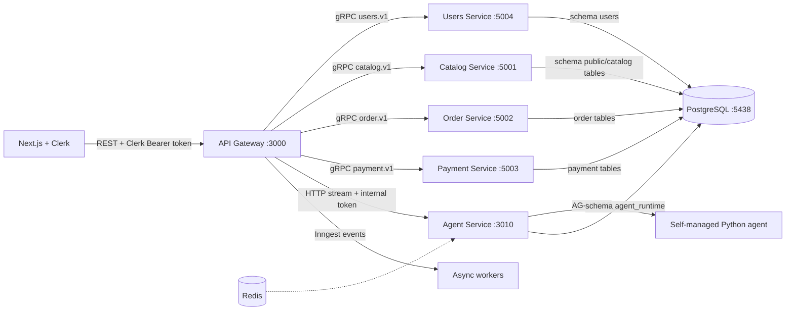

# Backend completion report

Ngày kiểm tra: 09/08/2026  
Phạm vi: API Gateway, Clerk authentication, Users gRPC service, Agent Service,
Catalog/Order/Payment contracts và local PostgreSQL.

## 1. Kiến trúc hiện tại



Gateway là boundary duy nhất của client. Client không biết gRPC và không được
gửi `x-user-id`/`x-user-role` để tự nâng quyền.

## 2. Clerk ở Dashboard và Gateway

Đăng nhập MVP:

- Email address: bật và yêu cầu xác minh bằng verification code.
- Google OAuth: bật nếu muốn.
- Password, phone, username: tắt theo cấu hình hiện tại.
- Organizations: `Membership optional`; không tạo organization tự động cho
  customer.

Session token custom claim cần có:

```json
{ "role": "{{user.public_metadata.role}}" }
```

Trong Clerk user public metadata, admin test có:

```json
{ "role": "admin" }
```

Sau khi đổi metadata, user phải refresh session/sign in lại để token mới chứa
claim. Gateway kiểm tra chữ ký JWT bằng `CLERK_JWT_KEY`, sau đó tạo
`request.actor` gồm `userId`, `sessionId`, `role`, `orgId`, `requestId`.

Webhook cần tạo tại Clerk Dashboard:

```text
POST http://<public-host>/v1/webhooks/clerk
```

Events chọn `user.created`, `user.updated`, `user.deleted`. Lưu signing secret
vào `CLERK_WEBHOOK_SIGNING_SECRET`. Gateway giữ raw body, gọi
`verifyWebhook`, rồi chuyển event qua gRPC tới Users Service. Users Service lưu
`ClerkWebhookEvent.eventId` nên retry của Clerk là idempotent.

## 3. Files/contract quan trọng

- `proto/users.proto`: `GetUserByClerkId`, `UpsertClerkUser`,
  `DeleteClerkUser`, `ListUsers`.
- `apps/api-gateway/src/auth`: Clerk guard, role guard, actor decorator.
- `apps/api-gateway/src/users`: REST facade, lazy user sync và Clerk webhook.
- `apps/users/src`: Users gRPC server và Prisma client riêng.
- `apps/agent-service/src`: CopilotRuntime, thread routes, event store,
  durable runner và internal-auth guard.
- `apps/agent-service/prisma`: runtime persistence ở schema `agent_runtime`.
- `libs/contracts/src/generated`: code sinh từ proto; không sửa trực tiếp.

## 4. Environment names

Không commit `.env`. Chỉ cần kiểm tra tên biến sau trong local/CI:

```env
PORT=3000
DATABASE_URL=postgresql://.../ecommerce
USERS_GRPC_URL=127.0.0.1:5004
AGENT_SERVICE_URL=http://127.0.0.1:3010
AGENT_SERVICE_PORT=3010
AGENT_INTERNAL_TOKEN=<long-random-token>
CLERK_PUBLISHABLE_KEY=<pk_...>
CLERK_SECRET_KEY=<sk_...>
CLERK_JWT_KEY=<PEM public key>
CLERK_AUTHORIZED_PARTIES=http://localhost:3003
CLERK_WEBHOOK_SIGNING_SECRET=<svix secret>
OPENAI_API_KEY=<provider key, only in Python agent process>
```

`DATABASE_URL` là connection duy nhất tới database `ecommerce`. Users và Agent
vẫn dùng schema riêng (`users`, `agent_runtime`) do Prisma config tự thêm
`?schema=...`; đây là tách logical schema, không phải tách database.

`AGENT_INTERNAL_TOKEN` chỉ dùng giữa Gateway và Agent Service, không expose
cho frontend. Python agent chỉ nhận AG-UI request; không cần Clerk secret.

## 5. Chạy local

Terminal 1 — database:

```bash
docker compose -f docker-compose.catalog.yml up -d
```

Terminal 2 — migrations (chạy một lần sau khi DB healthy):

```bash
pnpm db:migrate:deploy
pnpm db:users:deploy
pnpm db:agent:deploy
```

Terminal 3–8 — services:

```bash
pnpm start:dev:users
pnpm start:dev:catalog
pnpm start:dev:order
pnpm start:dev:payment
pnpm start:dev:agent
pnpm start:dev:gateway
```

Nếu Prisma CLI không tự nạp biến trong shell, không sửa `.env`; truyền
connection URL local inline cho đúng lệnh `db:*` hoặc nạp dotenv trong shell.

## 6. Runtime và threads

Public runtime URL:

```text
http://localhost:3000/v1/api/copilotkit
```

Agent id là `dashboard`; không dùng `default`.

Agent Service dùng `createCopilotRuntimeHandler` (fetch-native) và bridge
Response stream sang Nest Express. Gateway chỉ proxy stream và gắn internal headers sau khi Clerk guard
đã xác minh:

```text
x-internal-service-token
x-user-id
x-user-role
x-request-id
```

Thread API:

```text
POST   /v1/api/copilotkit/threads
GET    /v1/api/copilotkit/threads
GET    /v1/api/copilotkit/threads/:id
GET    /v1/api/copilotkit/threads/:id/events
PATCH  /v1/api/copilotkit/threads/:id
DELETE /v1/api/copilotkit/threads/:id   # archive mềm, không xoá vật lý
```

Events được coalesce và lưu trong `agent_runtime.AgentEvent`; A2UI activity
payload đi cùng AG-UI event và được replay từ event store. Không dùng
CopilotKit Cloud/Intelligence cho persistence.

Runtime `/info` đã kiểm tra với kết quả `version: 1.64.1`, agent `dashboard`,
`mode: sse`. `a2uiEnabled` hiện `false` vì catalog A2UI production chưa được
đăng ký; đây là chủ ý để không quảng bá renderer khi backend chưa có schema.

## 7. AI smoke test đã chạy

Đã đọc các skill AG-UI, runtime, A2UI và CopilotKit debug trong
`/mnt/disk2/API-EBook/.agents/skills`. Một file smoke test Python tạm thời đã
được tạo rồi xoá sau khi chạy. Kết quả:

```text
LangGraph + ChatOpenAI(gpt-4o-mini) + ag-ui-langgraph
run 1: 23 AG-UI events; RUN_STARTED và RUN_FINISHED
run 2: 23 AG-UI events; RUN_STARTED và RUN_FINISHED
cùng threadId chạy liên tiếp thành công
```

Smoke test này xác nhận wire protocol và thread continuity; nó không biến
smoke test thành code production trong `agent-python`.

## 8. Test matrix

Đã chạy:

```text
pnpm build                         pass (Gateway, Users, Agent, Catalog, Order, Payment)
pnpm exec jest --runInBand         21 suites, 48 tests passed
Users migration deploy             applied
Agent migration deploy             applied
Catalog migration deploy           no pending migrations
Gateway /v1/health                 HTTP 200
Gateway /v1/me without token       HTTP 401
Agent /health                      runtime online
Agent thread create/list/archive   pass with internal actor
Python live AG-UI smoke test       pass with gpt-4o-mini
Inngest event publisher tests      pass; 4 functions registered
```

`pnpm lint` hiện chưa xanh vì repository có nhiều lỗi format/type-safety cũ ở
Catalog/Order/Payment và thread-manager; đây là việc riêng nên xử lý theo batch,
không liên quan đến việc secret hay Clerk claim.

## 8.1. Inngest event flow hiện tại

Gateway đăng ký 4 consumer functions tại `/v1/inngest`:

```text
welcome-user-email
order-created-email
payment-status-email
low-stock-admin-alert
```

Producer hiện có:

```text
Clerk user.created       → ecommerce/user.created
Order commit             → ecommerce/order.created
Stripe webhook commit    → ecommerce/payment.status.changed
Catalog product mutation → ecommerce/product.low_stock
```

Local không có `MAIL_*` thì email function trả `skipped`; production cần Gmail
SMTP App Password. Inngest không thay thế gRPC và chưa có transactional outbox;
outbox/dead-letter reconciliation là việc cần làm khi scale.

## 8.2. Demo data

`pnpm db:seed:demo` đã chạy thành công và upsert `48` products, `72` orders cùng
payment rows tương ứng. Project mẫu không có dataset seed hoàn chỉnh để copy;
chi tiết mapping và cách chạy lại nằm trong `DEMO_DATA_GUIDE.md`.

## 9. Postman quick checklist

Tạo environment:

```text
baseUrl = http://localhost:3000
clerkToken = <session token lấy từ Clerk frontend>
```

Collection Authorization: `Bearer {{clerkToken}}`.

Requests nên chạy theo thứ tự:

1. `GET {{baseUrl}}/v1/health` — không cần token.
2. `GET {{baseUrl}}/v1/me` — kiểm tra user được lazy-sync vào Users Service.
3. `GET {{baseUrl}}/v1/admin/users` — yêu cầu token có claim `role=admin`.
4. `GET {{baseUrl}}/v1/products` và CRUD product — kiểm tra Catalog.
5. `POST {{baseUrl}}/v1/orders` với header `Idempotency-Key` — tạo order.
6. `POST {{baseUrl}}/v1/payments/checkout` — tạo Stripe Checkout sandbox.
7. `GET {{baseUrl}}/v1/api/copilotkit/health` — runtime discovery.
8. `POST {{baseUrl}}/v1/api/copilotkit/threads` — tạo thread.
9. `GET {{baseUrl}}/v1/api/copilotkit/threads` — danh sách thread active.
10. `POST {{baseUrl}}/v1/api/copilotkit/agent/dashboard/run` — chọn `raw`
    response và bật streaming để thấy từng `data:` AG-UI event.

Không gửi `x-user-id`, `x-user-role` từ Postman để nâng quyền; Gateway bỏ qua
identity giả và dùng Clerk token.

## 10. Việc cần làm trước production

Inngest hiện đã có event flow cho user/order/payment/low-stock và Gmail SMTP
adapter. Cần cấu hình `MAIL_*` bằng Gmail App Password trước khi xác nhận email
thật; local không có các biến này sẽ đánh dấu email là `skipped`.

- Đưa `AGENT_INTERNAL_TOKEN`/Clerk/Stripe/OpenAI secrets vào AWS Secrets
  Manager hoặc Parameter Store.
- Đăng ký Clerk webhook bằng HTTPS public endpoint và kiểm tra retry logs.
- Bật Redis coordinator khi chạy nhiều Agent instance; local hiện có thể dùng
  in-memory coordinator.
- Thêm rate limit, tracing, audit log và test e2e có Clerk test token.
- Đăng ký A2UI catalog thật ở runtime/client trước khi bật `a2ui` renderer;
  không bật generative UI toàn bộ dashboard.

## 11. CopilotKit runtime/thread hay assistant-ui?

Đây là hai lớp khác nhau, không phải hai lựa chọn thay thế trực tiếp:

```text
CopilotKit Runtime + AG-UI backend
  = runtime discovery, agent routing, SSE, tool/state events

assistant-ui
  = React chat UI/runtime adapter ở frontend
```

Tài liệu assistant-ui hiện có `@assistant-ui/react-ag-ui`, adapter nói chuyện
được với AG-UI server gồm cả backend CopilotKit; nó nằm trên
`ExternalStoreRuntime`, parse event và dựng lại message ở client. Nó không thay
CopilotRuntime, không thay Users/Auth và không tự tạo database thread cho
backend của project này.

Với backend hiện tại, có hai hướng hợp lệ:

1. Giữ `@copilotkit/react-core/v2` + `CopilotChat`/custom UI. Đây là hướng đang
   chạy trong `E-commern-test-ui`, ít package hơn và phù hợp để hoàn thành MVP.
2. Dùng assistant-ui làm UI sau này: `@assistant-ui/react-ag-ui` + `HttpAgent`
   trỏ vào Gateway, rồi nối `ExternalStoreThreadListAdapter`/history adapter
   vào `/v1/api/copilotkit/threads` và `/events`. Backend CopilotKit/Agent
   Service vẫn giữ nguyên.

Không cần chuyển sang assistant-ui chỉ vì đang tự lưu threads. Tự quản lý hiện
tại là quyết định phù hợp với constraint self-managed/no CopilotKit Cloud,
nhưng phải duy trì replay, lock, ownership, archive và event persistence — các
phần này đã nằm trong Agent Service và đã có test. Khi scale nhiều instance,
Redis coordinator và observability là bắt buộc.
