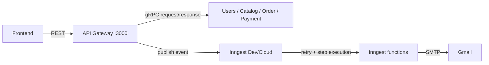

# Inngest event flow

Inngest là lớp xử lý event/background workflow của backend. Nó không thay thế
REST hoặc gRPC:



## Event catalog

| Event | Producer | Consumers |
|---|---|---|
| `ecommerce/user.created` | Clerk webhook sau khi Users upsert | Welcome email |
| `ecommerce/order.created` | Gateway sau Order commit | Order email, audit |
| `ecommerce/payment.status.changed` | Stripe webhook sau Payment commit | Payment email |
| `ecommerce/product.low_stock` | Gateway sau product create/update | Admin low-stock email |

Event IDs ổn định theo business ID để replay/retry không tạo side effect ngẫu
nhiên. Inngest functions dùng `step.run()` và retry tối đa 3 lần.

## Local configuration

Thêm vào `.env` khi muốn gửi email thật:

```env
INNGEST_DEV=1
INNGEST_EVENT_KEY=
INNGEST_SIGNING_KEY=
INNGEST_SERVE_ORIGIN=http://localhost:3000/v1/inngest

MAIL_HOST=smtp.gmail.com
MAIL_PORT=465
MAIL_SECURE=true
MAIL_USER=<gmail-address>
MAIL_PASSWORD=<gmail-app-password>
MAIL_FROM=<sender-address>
ADMIN_ALERT_EMAIL=<admin-address>
```

Không dùng mật khẩu Gmail chính. Tạo App Password sau khi bật MFA. Nếu chưa
điền `MAIL_*`, local function sẽ trả về `skipped`; production sẽ báo lỗi để
không giả vờ gửi email thành công.

## Chạy

Terminal Gateway:

```bash
pnpm start:dev:gateway
```

Terminal Inngest Dev Server:

```bash
npx inngest-cli@latest dev -u http://localhost:3000/v1/inngest/
```

Kiểm tra function registration:

```bash
curl -i http://localhost:3000/v1/inngest/
```

Dev UI phải hiển thị:

```text
welcome-user-email
order-created-email
payment-status-email
low-stock-admin-alert
```

## Test flow

1. Tạo order với `Idempotency-Key` mới → kiểm tra `ecommerce/order.created`.
2. Gửi lại cùng request → không tạo order thứ hai.
3. Tạo Stripe Checkout sandbox và chạy:

   ```bash
   stripe listen --forward-to http://localhost:3000/v1/payments/webhook/stripe
   ```

4. Thanh toán bằng `4242 4242 4242 4242` → kiểm tra
   `ecommerce/payment.status.changed`.
5. Tạo/cập nhật product xuống dưới reorder point → kiểm tra
   `ecommerce/product.low_stock`.
6. Replay cùng Stripe event → Payment idempotent và không gửi email trùng.
7. Tạo user bằng Clerk webhook thật → kiểm tra welcome function.

## Failure handling

- gRPC request không chờ Inngest function hoàn tất.
- Event chỉ được phát sau khi transaction nghiệp vụ đã commit.
- Function throw lỗi sẽ được Inngest retry.
- Email provider không khả dụng sẽ làm function fail/retry ở production.
- Outbox/dead-letter reconciliation sẽ được bổ sung khi scale; MVP dùng
  Inngest delivery và deterministic event IDs.

## Files chính

- `apps/api-gateway/src/inngest/event-types.ts`: event names/payload types.
- `apps/api-gateway/src/inngest/inngest.client.ts`: producers và consumers.
- `apps/api-gateway/src/inngest/email.service.ts`: Gmail SMTP adapter.
- `apps/api-gateway/src/inngest/inngest.controller.ts`: Inngest endpoint.
