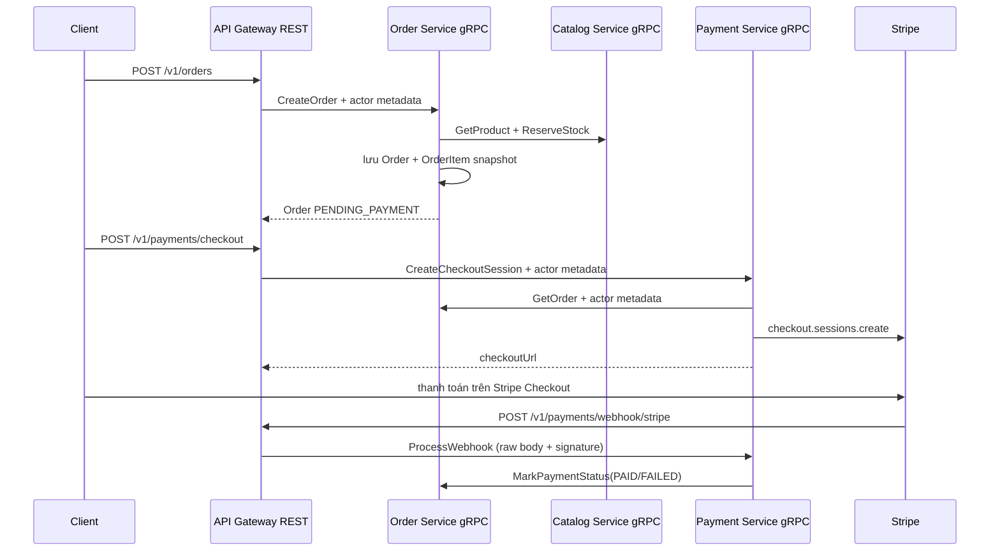

# Order Service — hướng dẫn triển khai và kiểm thử

Order Service sở hữu `Order` và `OrderItem`. Nó không đọc database của Catalog
hoặc Payment trực tiếp; mọi giao tiếp liên service dùng gRPC.

## Luồng tổng thể



## 1. Tạo Order

```http
POST /v1/orders
Authorization: Bearer <Clerk session token>
Idempotency-Key: order-demo-001
Content-Type: application/json
```

```json
{
  "items": [{ "productId": "<product-id>", "quantity": 2 }],
  "shippingAddress": {
    "recipientName": "Nguyen Van A",
    "phone": "0900000000",
    "line1": "1 Nguyen Hue",
    "city": "HCM",
    "countryCode": "VN"
  }
}
```

Gateway xác thực Clerk rồi truyền `x-user-id`, `x-user-role` và request ID trong
gRPC metadata. Order Service thực hiện:

1. yêu cầu actor metadata và idempotency key;
2. gọi `CatalogService.GetProduct` cho từng item;
3. từ chối product không tồn tại, archived hoặc khác currency;
4. tính tiền bằng integer minor units;
5. gọi `CatalogService.ReserveStock` với reservation ID
   `order:<userId>:<idempotencyKey>`;
6. lưu tên, ID, đơn giá và line total vào `OrderItem`;
7. nếu lưu database thất bại, gọi `CatalogService.ReleaseStock`.

Retry cùng user và cùng `Idempotency-Key` trả lại Order cũ, không reserve kho lần
hai.

## 2. Tạo Checkout

```http
POST /v1/payments/checkout
Authorization: Bearer <Clerk session token>
Content-Type: application/json
```

```json
{
  "orderId": "<order-id>",
  "successUrl": "http://localhost:3001/payment/success",
  "cancelUrl": "http://localhost:3001/payment/cancel"
}
```

Payment Service gọi `OrderService.GetOrder`. Order Service kiểm tra ownership
theo actor metadata; Payment không nhận `amount` từ client. Stripe Session được
tạo từ `Order.total` và lưu `providerSessionId`.

Retry checkout của cùng Order sẽ retrieve Session cũ và trả lại `checkoutUrl`.

## 3. Webhook và trạng thái

```bash
stripe listen --forward-to http://localhost:3000/v1/payments/webhook/stripe
```

Gateway route webhook là public để Stripe gọi được, nhưng Payment Service luôn
verify `stripe-signature` bằng `STRIPE_WEBHOOK_SECRET` trên raw request body.

| Stripe event | Payment | Order |
|---|---|---|
| `checkout.session.completed` | `PAID` | `PAID` |
| `checkout.session.async_payment_succeeded` | `PAID` | `PAID` |
| `checkout.session.async_payment_failed` | `FAILED` | `PAYMENT_FAILED` |

Event ID đã xử lý được bỏ qua khi Stripe retry. Order đã `PAID` không bị hạ
xuống `FAILED` bởi event đến trễ.

## 4. Hủy Order và trả kho

```http
POST /v1/orders/<order-id>/cancel
Authorization: Bearer <Clerk session token>
```

Chỉ Order `PENDING_PAYMENT` mới được hủy. Service release đúng reservation ID
đã tạo lúc create (`order:<userId>:<idempotencyKey>`), sau đó chuyển Order thành
`CANCELLED`. Release lặp lại là thao tác an toàn.

## 5. Các lỗi cần test

- thiếu Clerk token/actor metadata → `UNAUTHENTICATED`;
- thiếu idempotency key → `INVALID_ARGUMENT`;
- quantity <= 0, product archived, thiếu kho → `INVALID_ARGUMENT`/
  `FAILED_PRECONDITION`;
- đọc/hủy Order của user khác → `PERMISSION_DENIED`;
- Stripe signature sai → HTTP `400`;
- gửi lại cùng webhook event → không tạo thêm cập nhật;
- cancel sau khi đã paid → `FAILED_PRECONDITION`.

## 6. Chạy service và test

```bash
docker compose -f docker-compose.catalog.yml up -d
pnpm db:catalog:generate
pnpm db:order:generate
pnpm db:payment:generate
pnpm db:catalog:migrate

pnpm exec nest start catalog --watch
pnpm exec nest start order --watch
pnpm exec nest start payment --watch
pnpm run start:dev
pnpm test --runInBand
pnpm build
```
