# System Design — E-commerce Operations Dashboard + AI Copilot

> **Current implementation note (2026-08-04):** The active repository keeps
> durable Threads/Event persistence and exposes a self-managed CopilotKit
> multi-route URL at `/v1/api/copilotkit` through the official Express adapter.
> The upstream agent remains external via `AGENT_URL`; the historical Python/A2A
> sections below are future-agent references, not a process that Gateway starts
> automatically.

> Trạng thái: Architecture baseline cho MVP
> Đối tượng: Dự án cá nhân/team một người, MVP 2–4 tuần
> Cập nhật: 2026-07-29
> Repository: `Microservice-E-Commerce`

## 1. Executive summary

Hệ thống được chốt là một **E-commerce Operations Dashboard** dành cho nhân
viên vận hành cửa hàng nhỏ. Sản phẩm quản lý catalog, tồn kho và đơn hàng, đồng
thời cung cấp AI Copilot để:

1. phân tích KPI bán hàng và phát hiện bất thường;
2. truy vấn đơn hàng bằng ngôn ngữ tự nhiên;
3. đề xuất, hiển thị và yêu cầu người dùng xác nhận thao tác hàng loạt.

Đây không phải storefront hoàn chỉnh. MVP không làm cart, checkout, payment
gateway, shipping integration hoặc customer-facing authentication. Việc thu
gọn domain giúp dự án vẫn thể hiện được microservice, gRPC, AG-UI, A2A, A2UI,
Inngest, CI/CD và AWS mà không biến thành một hệ thống thương mại điện tử quá
lớn cho một người.

Các quyết định quan trọng:

| Hạng mục          | Quyết định                                                |
| ----------------- | --------------------------------------------------------- |
| Frontend          | Next.js + TypeScript + TailwindCSS + shadcn/ui            |
| Public API        | NestJS API Gateway, REST/HTTP                             |
| Business RPC      | Gateway/Agent → business services bằng gRPC               |
| Agent transport   | `HttpAgent` → Gateway → Agent Service bằng AG-UI HTTP/SSE |
| Agent core        | Python + FastAPI + LangGraph/LangChain                    |
| Agent-to-agent    | Đúng một Main Agent → Analytics Agent qua A2A             |
| Generative UI     | A2UI v0.9.1, giới hạn hai use case                        |
| Auth              | Clerk; Gateway verify JWT tập trung                       |
| Database          | Một PostgreSQL instance, schema và role tách theo service |
| ORM/data access   | Prisma cho NestJS; Alembic/asyncpg cho Python             |
| Agent persistence | Thread metadata + AG-UI events + LangGraph PostgresSaver  |
| Async jobs        | Inngest; không dùng làm synchronous service bus           |
| MVP deploy        | AWS EC2 + Docker Compose + RDS + ECR + SSM                |
| Scale target      | ECS Fargate khi có nhu cầu thực tế                        |

## 2. Mục tiêu và giới hạn

### 2.1. Mục tiêu

- Có kiến trúc production-oriented nhưng vận hành được bởi một người.
- Mọi service có boundary và quyền sở hữu dữ liệu rõ ràng.
- Client không biết và không gọi gRPC.
- AI agent không truy cập trực tiếp database nghiệp vụ.
- Threads tồn tại qua restart mà không phụ thuộc CopilotKit Cloud.
- Có CI/CD thật từ GitHub Actions tới AWS.
- Có đường scale rõ ràng nhưng không trả chi phí scale từ ngày đầu.

### 2.2. Không thuộc MVP

- Public storefront, cart, checkout và payment.
- Đồng bộ hai chiều với Shopify/Amazon hoặc hãng vận chuyển.
- Kubernetes, service mesh và multi-region.
- Event streaming platform như Kafka.
- Nhiều agent chuyên biệt hoặc agent tự tạo agent.
- Vector database/RAG nếu chưa có use case tài liệu cụ thể.
- Time travel/branching cho hội thoại.
- Multi-node live reconnect hoặc WebSocket riêng cho agent.

## 3. Lựa chọn domain

### 3.1. Các phương án đã cân nhắc

| Domain                          | Điểm mạnh                                                     | Vấn đề                                                   | Kết luận           |
| ------------------------------- | ------------------------------------------------------------- | -------------------------------------------------------- | ------------------ |
| E-commerce storefront đầy đủ    | Boundary catalog/order/payment tự nhiên                       | Cart, checkout, payment và shipping làm scope tăng nhanh | Không chọn cho MVP |
| Content Marketing SaaS          | Dễ demo AI và generative UI                                   | Lý do dùng nhiều microservice/gRPC yếu                   | Không chọn         |
| E-commerce Operations Dashboard | Boundary nghiệp vụ rõ, dữ liệu phù hợp analytics, A2UI có ích | Cần giữ scope chỉ ở backoffice                           | **Chọn**           |

### 3.2. Personas và luồng chính

- **Admin**: quản lý catalog, tồn kho, thành viên và mọi đơn hàng.
- **Operator**: xem/xử lý đơn, sử dụng Copilot, không quản trị hệ thống.
- **Viewer**: chỉ xem dashboard và báo cáo.

Luồng MVP:

1. Admin tạo sản phẩm và cập nhật tồn kho.
2. Operator tạo/import đơn mẫu và thay đổi trạng thái xử lý.
3. Người dùng hỏi Copilot về doanh thu, đơn lỗi hoặc sản phẩm sắp hết.
4. Copilot lấy dữ liệu qua gRPC, có thể giao snapshot KPI cho Analytics Agent.
5. Copilot trả text và A2UI report.
6. Với thao tác ghi, Copilot hiển thị form xác nhận trước khi gọi Order Service.

## 4. Kiến trúc tổng thể

### 4.1. System context

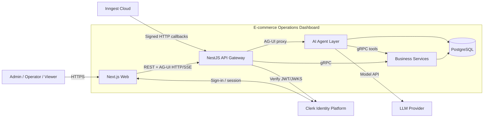

Chỉ Web và Gateway được public. Các business service và agent service nằm trên
Docker network nội bộ. Inngest gọi các endpoint đã xác thực tại Gateway; Gateway
chuyển request tới handler thuộc service sở hữu tác vụ.

### 4.2. Container/service view

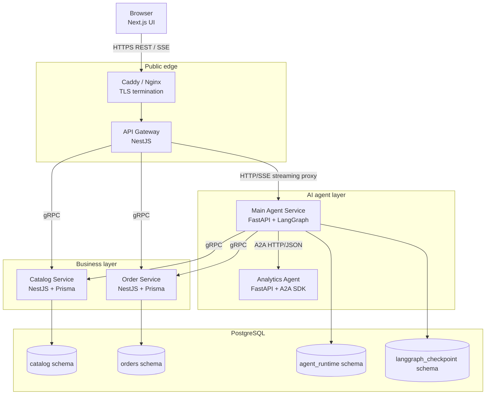

### 4.3. Service boundaries

#### API Gateway

Trách nhiệm:

- expose REST API cho browser;
- verify Clerk session JWT;
- map role và tạo trusted actor context;
- validate public DTO;
- gọi Catalog/Order qua gRPC;
- map gRPC status sang HTTP status;
- proxy AG-UI request/response theo kiểu streaming, không buffer;
- rate limit, correlation ID và public audit logging.

Gateway phải stateless và không có database riêng trong MVP.

#### Catalog Service

Trách nhiệm:

- product, category, price;
- inventory hiện tại;
- inventory adjustment history;
- low-stock query và inventory summary.

Catalog không biết order workflow. Order Service chỉ lưu snapshot tên/SKU/giá
của item tại thời điểm tạo đơn, không foreign key xuyên schema tới Product.

#### Order Service

Trách nhiệm:

- customer snapshot tối thiểu;
- order và order item;
- order status transition;
- bulk status update có idempotency;
- thống kê order/revenue cơ bản phục vụ agent.

Order Service không gửi email trực tiếp trong transaction. Nó phát Inngest
event sau khi commit.

#### Main Agent Service

Trách nhiệm:

- endpoint tương thích `@ag-ui/client` `HttpAgent`;
- LangGraph orchestration;
- tool gọi business service qua gRPC;
- thread ownership, run lifecycle và AG-UI event history;
- LangGraph checkpoint;
- chuyển A2UI message qua AG-UI;
- gọi đúng một Analytics Agent qua A2A.

Main Agent không đọc bảng `catalog` hoặc `orders`.

#### Analytics Agent

Chỉ có một skill nghiệp vụ:

```text
analyze_order_metrics
```

Input là snapshot KPI đã được Main Agent lọc và loại PII. Output là structured
artifact gồm KPI, xu hướng, anomaly và explanation. Agent này không có DB,
không gọi business service và không được gọi agent khác.

### 4.4. Cấu trúc monorepo đích

```text
apps/
  web/
  api-gateway/
  catalog-service/
  order-service/
  agent-service/
  analytics-agent/
packages/
  proto/
  config/
  observability/
infra/
  compose/
  scripts/
docs/
  SYSTEM_DESIGN.md
```

Repository hiện tại mới có `api-gateway`, `auth` và `auth.proto` dạng demo.
Khi bắt đầu implementation:

- bỏ password khỏi mọi proto/response;
- không giữ Auth Service tự viết nếu đã chọn Clerk;
- thay `auth` demo bằng Catalog/Order service;
- đưa proto dùng chung vào `packages/proto` hoặc thư mục tương đương có codegen
  TypeScript và Python.

## 5. Giao tiếp giữa các service

### 5.1. Quy tắc protocol

| Nguồn      | Đích            | Protocol       | Mục đích                      |
| ---------- | --------------- | -------------- | ----------------------------- |
| Browser    | Gateway         | REST/JSON      | CRUD và command thông thường  |
| Browser    | Gateway         | AG-UI HTTP/SSE | Interactive agent run         |
| Gateway    | Catalog/Order   | gRPC           | Synchronous business RPC      |
| Gateway    | Main Agent      | HTTP/SSE       | Giữ nguyên AG-UI transport    |
| Main Agent | Catalog/Order   | gRPC           | Agent tools                   |
| Main Agent | Analytics Agent | A2A            | Một specialized analysis task |
| Service    | Inngest         | HTTPS event    | Background/durable job        |
| Inngest    | Gateway/handler | Signed HTTPS   | Thực thi job                  |

AG-UI là transport-agnostic ở tầng event, nhưng `HttpAgent` hỗ trợ HTTP/SSE và
HTTP binary, không có gRPC binding dùng sẵn. Vì vậy không xây cầu
AG-UI↔gRPC tự chế trong MVP. Quy tắc chính xác là:

> Business RPC nội bộ dùng gRPC; các luồng có protocol chuyên biệt sử dụng
> binding chuẩn của AG-UI hoặc A2A.

### 5.2. REST surface

Public API đề xuất:

```text
GET    /v1/products
POST   /v1/products
GET    /v1/products/:id
PATCH  /v1/products/:id
GET    /v1/products/low-stock
POST   /v1/inventory/adjustments

GET    /v1/orders
POST   /v1/orders
GET    /v1/orders/:id
PATCH  /v1/orders/:id/status
POST   /v1/orders/bulk-status

POST   /v1/agent/run
GET    /v1/agent/threads
POST   /v1/agent/threads
GET    /v1/agent/threads/:threadId
PATCH  /v1/agent/threads/:threadId
DELETE /v1/agent/threads/:threadId
GET    /v1/agent/threads/:threadId/events

POST   /v1/inngest
```

Quy ước:

- cursor pagination cho danh sách có thể tăng lớn;
- ISO 8601 UTC trên wire;
- tiền tệ lưu minor unit, ví dụ `amount_minor = 125000`;
- mỗi mutation quan trọng nhận `Idempotency-Key`;
- lỗi public dùng một shape thống nhất:

```json
{
  "code": "ORDER_INVALID_TRANSITION",
  "message": "Không thể chuyển đơn đã hủy sang đang giao",
  "requestId": "req_01...",
  "details": {}
}
```

### 5.3. Proto minh họa

#### Common types

```proto
syntax = "proto3";

package common.v1;

message Money {
  int64 amount_minor = 1;
  string currency = 2;
}

message PageRequest {
  int32 page_size = 1;
  optional string cursor = 2;
}

message PageInfo {
  optional string next_cursor = 1;
}
```

Actor context không lấy từ request body. Nó được Gateway truyền qua gRPC
metadata:

```text
x-actor-context: base64url({
  "userId": "user_...",
  "orgId": "org_...",
  "roles": ["operator"],
  "requestId": "req_...",
  "issuedAt": 178...
})
x-actor-signature: HMAC-SHA256(actor-context)
x-request-id: req_...
```

#### Catalog

```proto
syntax = "proto3";

package catalog.v1;

import "common/v1/common.proto";

service CatalogService {
  rpc GetProduct(GetProductRequest) returns (Product);
  rpc ListProducts(ListProductsRequest) returns (ListProductsResponse);
  rpc CreateProduct(CreateProductRequest) returns (Product);
  rpc AdjustInventory(AdjustInventoryRequest) returns (Inventory);
  rpc GetInventorySummary(GetInventorySummaryRequest)
      returns (InventorySummary);
}

message GetProductRequest {
  string product_id = 1;
}

message ListProductsRequest {
  optional string search = 1;
  optional bool low_stock_only = 2;
  common.v1.PageRequest page = 3;
}

message CreateProductRequest {
  string name = 1;
  string sku = 2;
  common.v1.Money price = 3;
  int32 low_stock_threshold = 4;
}

message AdjustInventoryRequest {
  string product_id = 1;
  int32 delta = 2;
  string reason = 3;
  string idempotency_key = 4;
}

message Inventory {
  string product_id = 1;
  int32 quantity = 2;
  int32 low_stock_threshold = 3;
}

message InventorySummary {
  int32 total_products = 1;
  int32 low_stock_products = 2;
  repeated Inventory low_stock_items = 3;
}
```

#### Orders

```proto
syntax = "proto3";

package orders.v1;

import "common/v1/common.proto";

service OrderService {
  rpc GetOrder(GetOrderRequest) returns (Order);
  rpc ListOrders(ListOrdersRequest) returns (ListOrdersResponse);
  rpc CreateOrder(CreateOrderRequest) returns (Order);
  rpc UpdateOrderStatus(UpdateOrderStatusRequest) returns (Order);
  rpc BulkUpdateStatus(BulkUpdateStatusRequest)
      returns (BulkUpdateStatusResponse);
  rpc GetOrderMetrics(GetOrderMetricsRequest) returns (OrderMetrics);
}

enum OrderStatus {
  ORDER_STATUS_UNSPECIFIED = 0;
  ORDER_STATUS_PENDING = 1;
  ORDER_STATUS_CONFIRMED = 2;
  ORDER_STATUS_PROCESSING = 3;
  ORDER_STATUS_SHIPPED = 4;
  ORDER_STATUS_DELIVERED = 5;
  ORDER_STATUS_CANCELLED = 6;
}

message GetOrderRequest {
  string order_id = 1;
}

message ListOrdersRequest {
  optional OrderStatus status = 1;
  optional string search = 2;
  optional string created_from = 3;
  optional string created_to = 4;
  common.v1.PageRequest page = 5;
}

message UpdateOrderStatusRequest {
  string order_id = 1;
  OrderStatus target_status = 2;
  string reason = 3;
  string idempotency_key = 4;
}

message BulkUpdateStatusRequest {
  repeated string order_ids = 1;
  OrderStatus target_status = 2;
  string reason = 3;
  string idempotency_key = 4;
}

message OrderMetrics {
  string period_from = 1;
  string period_to = 2;
  common.v1.Money revenue = 3;
  int32 order_count = 4;
  int32 cancelled_count = 5;
  double average_order_value_minor = 6;
  repeated DailyMetric daily = 7;
}
```

Proto thật cần thêm response messages, validation và reserved field numbers.
Không tái sử dụng field number sau khi xóa field.

### 5.4. NestJS Gateway không phải hybrid server

Gateway cần một HTTP application và các gRPC client:

```text
NestFactory.create(AppModule)
  ├── REST controllers
  ├── Clerk guard
  ├── ClientsModule.register(CATALOG_PACKAGE)
  └── ClientsModule.register(ORDERS_PACKAGE)
```

Không gọi `app.connectMicroservice()` chỉ để Gateway gọi gRPC. `connectMicroservice`
chỉ cần khi cùng process còn phải **nhận** message như một microservice server.
Catalog và Order dùng `NestFactory.createMicroservice()` với gRPC transport.

### 5.5. REST → gRPC sequence

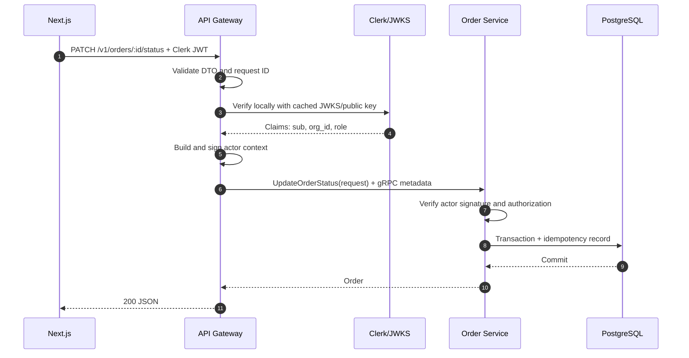

Trong thực tế bước verify dùng cached public key nên không gọi network tới Clerk
trên từng request.

### 5.6. Error mapping

| gRPC status           |    HTTP | Ví dụ                                          |
| --------------------- | ------: | ---------------------------------------------- |
| `INVALID_ARGUMENT`    |     400 | DTO/domain input không hợp lệ                  |
| `UNAUTHENTICATED`     |     401 | Actor context thiếu/sai                        |
| `PERMISSION_DENIED`   |     403 | Role hoặc tenant không được phép               |
| `NOT_FOUND`           |     404 | Resource không tồn tại hoặc không thuộc tenant |
| `ALREADY_EXISTS`      |     409 | SKU/idempotency key xung đột                   |
| `FAILED_PRECONDITION` | 409/422 | Order transition không hợp lệ                  |
| `RESOURCE_EXHAUSTED`  |     429 | Rate/quota                                     |
| `UNAVAILABLE`         |     503 | Service tạm thời không sẵn sàng                |
| `DEADLINE_EXCEEDED`   |     504 | RPC timeout                                    |
| `INTERNAL`            |     500 | Lỗi không phân loại                            |

Không đưa stack trace hoặc internal database error ra public response.

## 6. Database architecture

### 6.1. Một instance, ownership tách biệt

MVP dùng một PostgreSQL/RDS instance để giảm chi phí và vận hành:

```text
PostgreSQL instance
  ├── schema catalog
  │    └── role catalog_app
  ├── schema orders
  │    └── role orders_app
  ├── schema agent_runtime
  │    └── role agent_app
  └── schema langgraph_checkpoint
       └── role agent_app
```

Quy tắc:

- mỗi role chỉ có quyền trên schema của mình;
- mỗi service có migration history riêng;
- không foreign key hoặc join xuyên schema;
- không import Prisma client của service khác;
- trao đổi dữ liệu qua contract, không qua SQL;
- khi tách physical DB sau này, public API và proto không đổi.

### 6.2. Domain data model

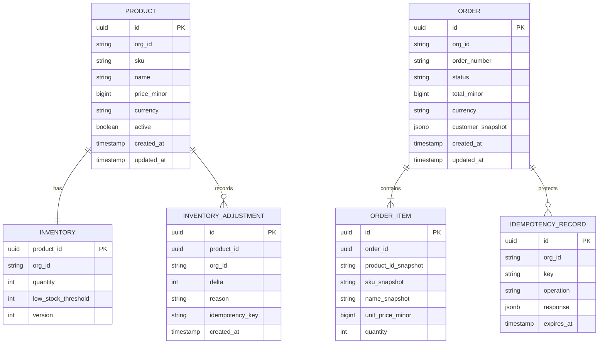

Mọi bảng nghiệp vụ có `org_id` và index bắt đầu bằng `org_id` đối với query
tenant-scoped. Service luôn lấy `org_id` từ verified actor context, không lấy từ
body hoặc query string.

### 6.3. SQLite policy

SQLite phù hợp cho:

- unit test repository;
- local demo một process;
- LangGraph `SqliteSaver` khi không cần restart/multi-process semantics.

SQLite không dùng cho:

- migration acceptance;
- gRPC integration test;
- concurrency/idempotency test;
- staging/production.

Local integration dùng PostgreSQL qua Docker Compose. Cách này tránh tình trạng
schema Prisma chạy được trên SQLite nhưng hỏng khi deploy PostgreSQL.

## 7. Authentication và authorization

### 7.1. So sánh lựa chọn

| Giải pháp   | Ưu điểm                                               | Nhược điểm                                      | Kết luận          |
| ----------- | ----------------------------------------------------- | ----------------------------------------------- | ----------------- |
| Clerk       | Next.js DX tốt, session/JWT, organizations, UI có sẵn | Managed dependency, chi phí khi lớn             | **Chọn cho MVP**  |
| Auth0       | OIDC/OAuth/SAML và enterprise federation mạnh         | Cấu hình và pricing nặng hơn use case           | Không chọn        |
| Better Auth | Self-hosted, TypeScript-first, kiểm soát data         | Tự chịu email, recovery, security và operations | Cân nhắc sau      |
| Keycloak    | Đầy đủ OIDC/SAML, self-hosted                         | JVM service, DB, upgrade và vận hành nặng       | Không phù hợp MVP |
| Lucia       | Dễ học session internals                              | Lucia v3 đã deprecated                          | Không dùng        |

### 7.2. Auth flow

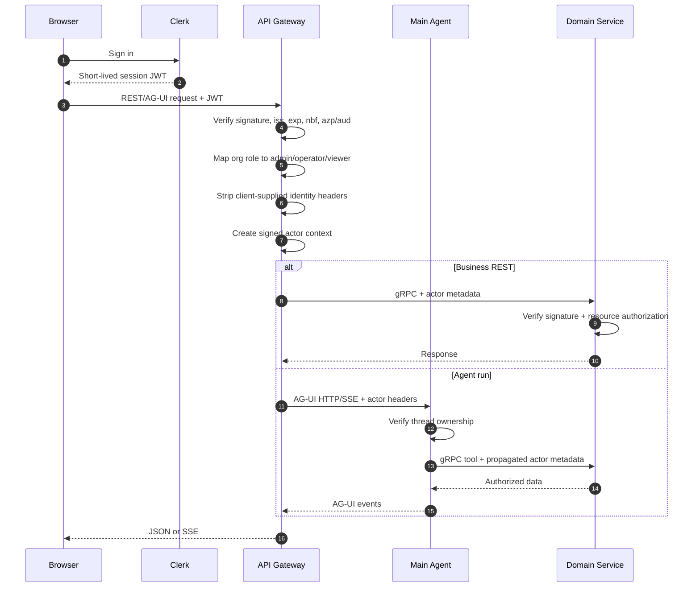

### 7.3. Phân chia trách nhiệm auth

Gateway:

- xác thực JWT;
- validate issuer/audience/authorized parties;
- rate limit theo actor/org;
- route-level RBAC;
- tạo actor context đáng tin cậy.

Business service:

- xác minh actor context nội bộ;
- kiểm tra role cho operation;
- kiểm tra resource thuộc đúng `org_id`;
- trả `NOT_FOUND` thay vì tiết lộ resource thuộc tenant khác.

Agent service:

- thread luôn gắn `owner_user_id` và `org_id`;
- list/get/run/delete đều scope theo owner/org;
- tool call không được cho LLM sửa actor context;
- A2A payload không chứa email, địa chỉ hoặc customer PII.

### 7.4. Role matrix MVP

| Capability            | Admin | Operator | Viewer |
| --------------------- | :---: | :------: | :----: |
| Xem product/order     |   ✓   |    ✓     |   ✓    |
| Tạo/sửa product       |   ✓   |          |        |
| Điều chỉnh inventory  |   ✓   |    ✓     |        |
| Thay đổi order status |   ✓   |    ✓     |        |
| Bulk order action     |   ✓   |    ✓     |        |
| Dùng AI report        |   ✓   |    ✓     |   ✓    |
| Quản trị thành viên   |   ✓   |          |        |

## 8. AI Agent architecture

### 8.1. Vì sao agent là service riêng

Agent Service có lifecycle, dependency, scaling và persistence khác business
service:

- Python/LangGraph thay vì NestJS;
- kết nối model provider và stream lâu;
- checkpoint/event history tăng theo conversation;
- failure mode gồm provider timeout/rate limit;
- có thể scale độc lập với CRUD traffic.

Đặt LangGraph trong Order Service sẽ trộn domain transaction với model execution
và khiến deploy/scale khó hơn.

### 8.2. LangGraph đề xuất

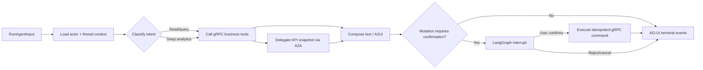

Tool allowlist:

- `list_orders`
- `get_order`
- `get_order_metrics`
- `get_inventory_summary`
- `propose_bulk_order_status`
- `execute_confirmed_bulk_order_status`
- `delegate_metric_analysis`

Tool schema do application định nghĩa. Model không được tạo arbitrary URL, SQL
hoặc gRPC method name.

### 8.3. AG-UI endpoint

Frontend:

```ts
const agent = new HttpAgent({
  url: '/v1/agent/run',
  agentId: 'commerce-ops',
  threadId,
});
```

Gateway:

- verify Clerk JWT trước khi mở upstream;
- chuyển `RunAgentInput` nguyên vẹn;
- thêm signed actor context;
- forward `Accept` và content type cần thiết;
- pipe stream thay vì gọi `arrayBuffer()`/buffer toàn response;
- khi browser abort, hủy upstream request;
- timeout riêng cho handshake, không áp timeout ngắn lên toàn SSE stream.

Agent phải phát:

```text
RUN_STARTED
  TEXT_MESSAGE_START
  TEXT_MESSAGE_CONTENT...
  TEXT_MESSAGE_END
  TOOL_CALL_* / STATE_* / CUSTOM(A2UI)...
RUN_FINISHED
```

Mọi error path kết thúc bằng `RUN_ERROR`. Không để stream đóng mà thiếu terminal
event.

### 8.4. Self-managed thread persistence

LangGraph checkpoint không thay thế thread/history store:

- checkpoint lưu graph state theo super-step;
- thread store lưu title, owner, status và danh sách hội thoại;
- event store lưu AG-UI history để reload UI.

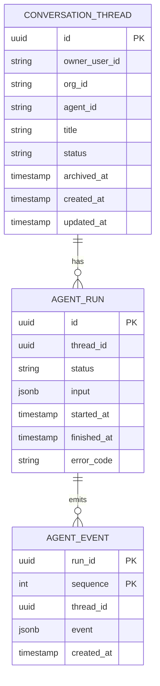

Identity invariant:

```text
HttpAgent.threadId
 == RunAgentInput.threadId
 == conversation_threads.id
 == agent_runs.thread_id
 == agent_events.thread_id
 == LangGraph configurable.thread_id
```

`runId` là một execution trong thread; không được dùng thay `threadId`.

Không tạo `conversation_messages` table. Khi run kết thúc:

- merge `TEXT_MESSAGE_*` thành `MESSAGES_SNAPSHOT`;
- giữ tool results, state, A2UI và lifecycle events;
- loại raw provider traces khỏi durable history;
- sequence lại event đã compact;
- persist `RUN_FINISHED` hoặc `RUN_ERROR`.

Một partial unique constraint chỉ cho phép một run `RUNNING` trên mỗi thread.
Request thứ hai nhận `409 THREAD_ALREADY_RUNNING`. Stale run được reconciliation
job chuyển sang `ERROR`.

### 8.5. Agent run và persistence flow

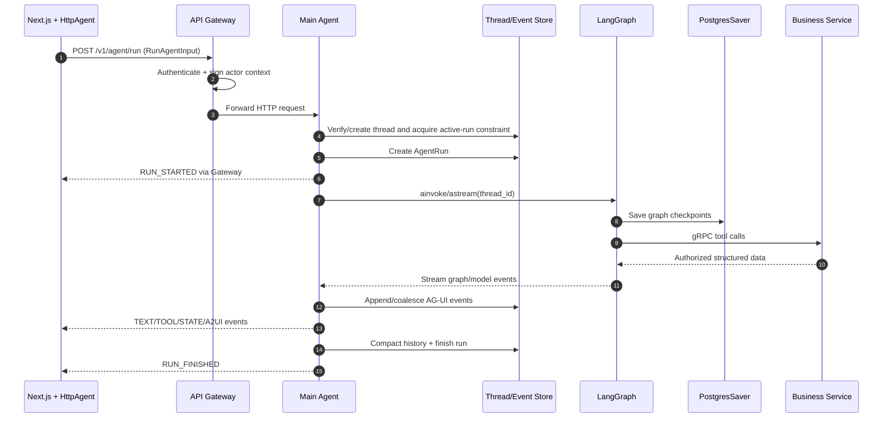

### 8.6. Reload/reconnect policy

MVP không xây WebSocket hoặc live multi-instance reconnect:

1. frontend gọi `GET /threads/:id/events`;
2. server kiểm tra ownership;
3. server trả compact semantic events;
4. frontend hydrate messages/state/A2UI surfaces;
5. run mới tiếp tục dùng cùng `threadId`.

Nếu reload khi run đang chạy, UI hiển thị trạng thái “run interrupted” và cho
phép retry sau khi stale-run timeout/reconciliation. Resumable live stream là
giai đoạn scale.

## 9. A2A — một sub-agent có kiểm soát

### 9.1. Contract

Analytics Agent publish Agent Card:

```text
GET /.well-known/agent-card.json
```

Card khai báo:

- agent name/version;
- A2A protocol version;
- HTTP/JSON hoặc JSON-RPC endpoint;
- non-streaming capability cho MVP;
- skill `analyze_order_metrics`;
- accepted input/output MIME type;
- bearer authentication requirement.

Input artifact:

```json
{
  "period": {
    "from": "2026-07-01T00:00:00Z",
    "to": "2026-07-29T23:59:59Z"
  },
  "currency": "VND",
  "totals": {
    "orders": 150,
    "revenueMinor": 725000000,
    "cancelled": 11
  },
  "daily": [],
  "dimensions": {
    "status": {},
    "topProducts": []
  }
}
```

Output artifact:

```json
{
  "summary": "Doanh thu tăng nhưng tỷ lệ hủy cao hơn tuần trước.",
  "kpis": [],
  "anomalies": [],
  "recommendations": [],
  "confidence": 0.82
}
```

### 9.2. Sequence

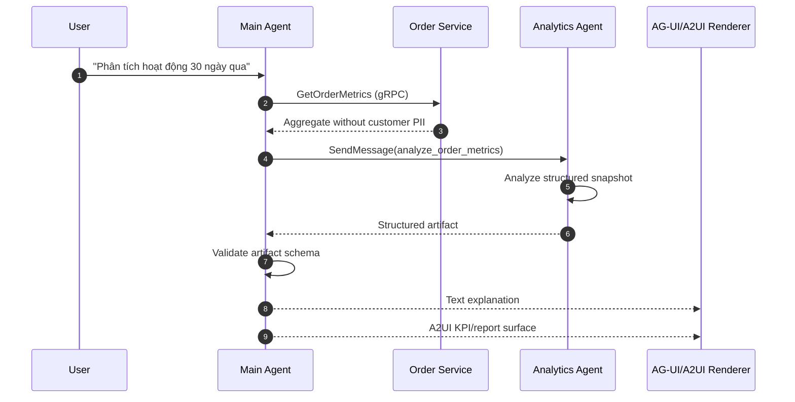

### 9.3. Failure policy

- connect timeout ngắn, overall deadline rõ ràng;
- retry tối đa một lần cho lỗi network tạm thời;
- không retry validation/4xx;
- circuit breaker đơn giản nếu agent liên tục lỗi;
- fallback: Main Agent tự trình bày metrics thô kèm thông báo chưa có phân tích;
- lưu A2A task ID và latency trong run metadata, không lưu secret;
- A2A service không public ra Internet.

## 10. A2UI — generative UI giới hạn

### 10.1. Phiên bản và renderer

Dùng **A2UI v0.9.1**. Frontend dùng low-level React renderer:

```text
@a2ui/react
@a2ui/web_core
```

Không dùng CopilotKit Runtime hoặc cơ chế auto-mount A2UI của
`CopilotKitProvider`. AG-UI chỉ làm transport; frontend tự route A2UI payload
tới renderer.

### 10.2. Custom catalog

Allowlist MVP:

```text
KpiGrid
KpiCard
TrendChart
OrdersTable
Alert
ConfirmationForm
Button
Text
Row
Column
```

Không hỗ trợ:

- arbitrary HTML;
- JavaScript do model sinh;
- iframe hoặc remote component;
- URL không nằm trong allowlist;
- component có side effect khi render.

Agent tạo structure và data; component implementation luôn nằm trong frontend.

### 10.3. AG-UI envelope

Trong self-managed integration, A2UI JSON được giữ nguyên bên trong AG-UI custom
event:

```json
{
  "type": "CUSTOM",
  "name": "a2ui",
  "value": {
    "version": "v0.9.1",
    "createSurface": {
      "surfaceId": "sales-report-run_123",
      "catalogId": "commerce-ops-v1"
    }
  }
}
```

Sau `createSurface`, agent chỉ phát:

- `updateComponents`;
- `updateDataModel`;
- `deleteSurface`.

`createSurface` chỉ phát một lần cho một `surfaceId`. Frontend validate:

1. AG-UI event schema;
2. A2UI envelope;
3. protocol version;
4. catalog ID;
5. component schema;
6. data binding paths.

Payload sai bị bỏ qua, log theo `runId`, và UI hiển thị fallback text.

### 10.4. Hai use case

#### Use case 1 — Sales/operations report

Analytics result được render thành:

- KPI cards;
- trend chart;
- bảng đơn bất thường;
- alert/recommendation.

Đây là read-only UI, không có side effect.

#### Use case 2 — Bulk order confirmation

Agent chỉ **đề xuất** mutation. A2UI form hiển thị:

- danh sách order IDs;
- trạng thái hiện tại và trạng thái đích;
- lý do;
- số lượng bản ghi ảnh hưởng;
- nút confirm/cancel.

### 10.5. Confirmation flow

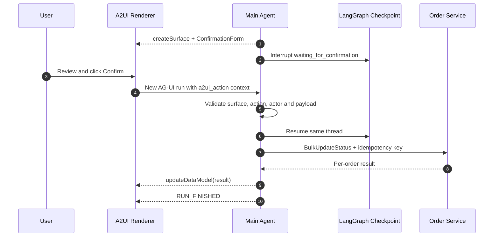

Action payload phải chứa `surfaceId`, `actionId`, selected values và
`idempotencyKey`. User confirmation không được suy ra từ text tự do.

## 11. Background jobs với Inngest

### 11.1. Boundary

Synchronous:

- CRUD/query cần phản hồi ngay;
- order validation/status transition;
- interactive agent streaming;
- A2A analysis ngắn trong một run.

Asynchronous:

- email order status;
- low-stock daily digest;
- CSV import/export;
- image processing;
- title generation không cần chặn response;
- report dài có thể trả task ID;
- reconciliation stale agent runs;
- event retention/cleanup.

### 11.2. Flow

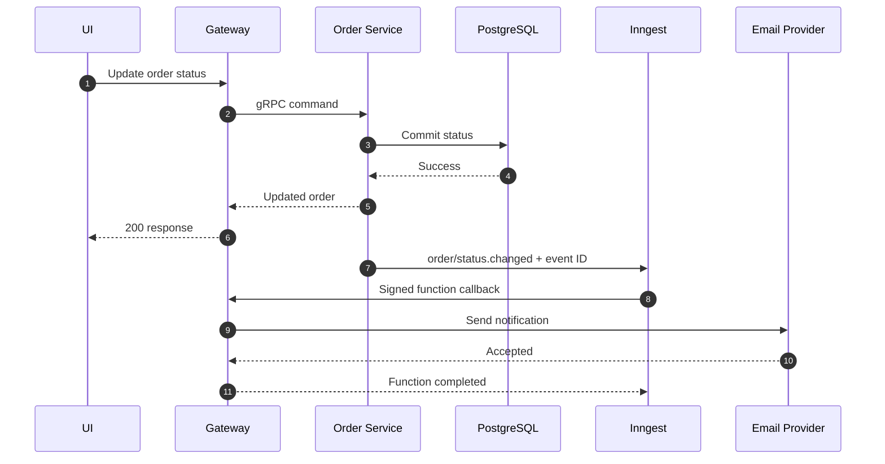

MVP gửi Inngest event sau DB commit và dùng idempotency key. Rủi ro process chết
giữa commit và emit được chấp nhận tạm thời, có reconciliation job. Giai đoạn 2
thêm transactional outbox:

```text
business transaction
  ├── update domain row
  └── insert outbox row

outbox dispatcher → Inngest → idempotent handler
```

Không dùng Inngest để thay thế gRPC giữa Gateway và business service.

## 12. Reliability và failure handling

### 12.1. Timeouts

| Call                             | Policy khởi điểm                       |
| -------------------------------- | -------------------------------------- |
| Gateway → business gRPC query    | 2–3 giây                               |
| Gateway → business gRPC mutation | 5 giây                                 |
| Main Agent → business gRPC       | 3–5 giây                               |
| Main Agent → A2A connect         | 2 giây                                 |
| Main Agent → A2A total           | 15–20 giây                             |
| LLM provider                     | Theo node, tối đa 30–60 giây           |
| AG-UI stream                     | Không dùng global request timeout ngắn |

Timeout chính xác phải được hiệu chỉnh bằng metrics thực tế.

### 12.2. Retry

- chỉ retry operation idempotent;
- exponential backoff + jitter;
- không retry validation, permission hoặc quota hard failure;
- mutation retry phải có idempotency key;
- model/A2A tối đa retry hữu hạn, không tạo retry loop;
- Inngest handler dựa vào at-least-once delivery và luôn idempotent.

### 12.3. Agent failure cases

| Failure                    | Hành vi                                                  |
| -------------------------- | -------------------------------------------------------- |
| Provider 429               | Phát `RUN_ERROR`, message thân thiện, không retry vô hạn |
| Provider stream đóng sớm   | Synthetic `RUN_ERROR`, persist run error                 |
| Client disconnect          | Cancel graph/model nếu có thể, đánh dấu `CANCELLED`      |
| A2A unavailable            | Fallback metrics thô                                     |
| Invalid A2UI               | Bỏ surface, giữ text response                            |
| Concurrent run cùng thread | `409 THREAD_ALREADY_RUNNING`                             |
| Process restart            | Hydrate từ events/checkpoint; stale run reconciliation   |
| Business service timeout   | Tool error có typed code; agent không bịa kết quả        |

### 12.4. Idempotency

Áp dụng cho:

- create/import order;
- inventory adjustment;
- order status mutation;
- A2UI confirmed bulk action;
- Inngest side effects.

Idempotency record scope theo `(org_id, operation, key)`. Reuse cùng key nhưng
payload khác trả conflict.

## 13. AWS deployment

### 13.1. MVP topology

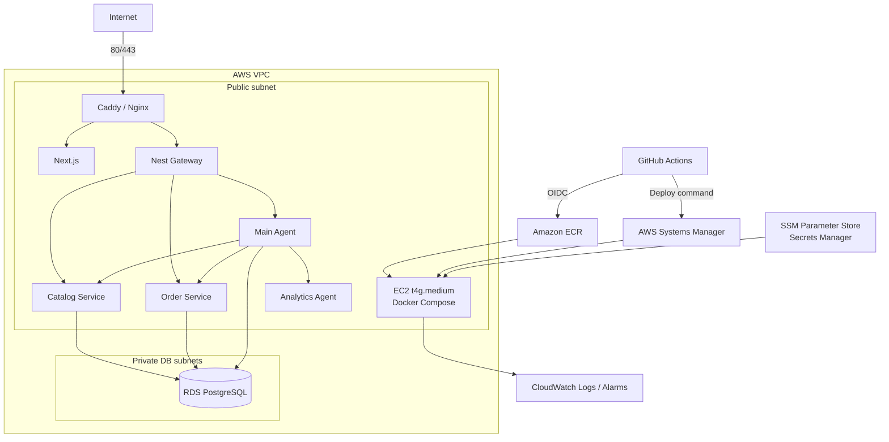

### 13.2. Network và security groups

- EC2 public inbound chỉ 80/443.
- Không mở SSH; dùng SSM Session Manager.
- RDS không public.
- RDS security group chỉ nhận 5432 từ EC2 security group.
- Container business/agent không publish port ra host trừ khi reverse proxy cần.
- Caddy/Nginx và Gateway là hai lớp duy nhất nhận public traffic.
- IMDSv2 bắt buộc.
- EC2 instance role chỉ có quyền pull ECR, đọc đúng secret path và ghi logs.
- GitHub role chỉ có quyền push đúng ECR repos và gọi đúng SSM target.

### 13.3. Vì sao chọn EC2 Compose

Ưu điểm:

- chi phí nền thấp;
- dễ hiểu toàn bộ networking/deploy path;
- phù hợp traffic MVP;
- vẫn học ECR, OIDC, SSM, health check và rollback;
- Compose tương đồng local/prod.

Trade-off:

- một host là single point of failure;
- deploy không zero-downtime hoàn hảo;
- tự quản OS/Docker patching;
- resource isolation kém hơn ECS;
- scale ngang cần migration hạ tầng.

### 13.4. So sánh lựa chọn AWS

| Lựa chọn       | Ưu điểm                               | Nhược điểm                                           | Thời điểm dùng     |
| -------------- | ------------------------------------- | ---------------------------------------------------- | ------------------ |
| EC2 + Compose  | Rẻ, ít moving parts                   | Không HA, tự quản host                               | **MVP**            |
| ECS Fargate    | Managed scheduling, rollout/scale tốt | ALB, task sizing và chi phí nền cao                  | Khi có traffic/SLA |
| App Runner     | Deploy HTTP service đơn giản          | Kém phù hợp nhiều internal gRPC service/SSE topology | App đơn lẻ         |
| Kubernetes/EKS | Ecosystem lớn                         | Quá nặng cho team một người                          | Không dự kiến      |

### 13.5. Chi phí cơ bản

Ước lượng cho region Singapore, cần kiểm tra lại bằng AWS Pricing Calculator
trước khi deploy:

| Hạng mục                         | Ước lượng/tháng |
| -------------------------------- | --------------: |
| EC2 + EBS + public IPv4          |       USD 35–55 |
| RDS PostgreSQL + storage/backups |       USD 20–40 |
| ECR + CloudWatch + transfer nhẹ  |        USD 5–20 |
| Tổng infrastructure              |  **USD 60–115** |

Không bao gồm:

- model token;
- domain/email provider;
- Clerk/Inngest paid tier;
- traffic lớn hoặc snapshot retention dài.

Nếu `t4g.medium` thiếu memory cho Next + ba Node process + hai Python process,
nâng `t4g.large` trước khi tối ưu phức tạp. Đo memory thực tế rồi mới quyết định.

### 13.6. Backup và restore

- RDS automated backup tối thiểu 7 ngày;
- snapshot trước migration có rủi ro;
- quarterly restore drill sang database tạm;
- migration chỉ theo hướng forward;
- không tự động chạy destructive reset trong CI/CD;
- checkpoint/event retention được định nghĩa ở giai đoạn 2.

## 14. CI/CD cho monorepo

### 14.1. Pipeline overview

```mermaid
flowchart LR
    Push["PR / Push"]
    Detect["Detect changed apps"]
    Contracts["Proto lint + generate<br/>breaking check"]
    TS["pnpm lint/test/build"]
    PY["uv + Ruff + mypy + pytest"]
    Integration["PostgreSQL integration tests"]
    Images["Build Docker images"]
    Scan["Image scan"]
    ECR["Push SHA-tagged images to ECR"]
    Approval{"Production approval"}
    Migrate["Run forward migrations"]
    Deploy["SSM deploy Compose"]
    Health{"Health checks pass?"}
    Success["Record release SHA"]
    Rollback["Rollback images"]

    Push --> Detect --> Contracts
    Contracts --> TS
    Contracts --> PY
    TS --> Integration
    PY --> Integration
    Integration --> Images --> Scan
    Scan -->|"PR"| Success
    Scan -->|"main"| ECR --> Approval
    Approval -->|"Approved"| Migrate --> Deploy --> Health
    Health -->|"Yes"| Success
    Health -->|"No"| Rollback
```

### 14.2. Pull request workflow

1. Checkout repository.
2. Detect paths bị thay đổi.
3. Setup pnpm/Node và uv/Python với cache.
4. Chạy `buf lint` và breaking change check.
5. Generate TypeScript và Python code từ proto.
6. Kiểm tra generated code sạch, không drift.
7. TypeScript lint, typecheck, unit test và build.
8. Python Ruff, mypy, pytest.
9. Khởi động PostgreSQL service container.
10. Apply Prisma/Alembic/checkpointer migrations trên DB test.
11. Chạy contract/integration/e2e tests.
12. Build Docker image cho app bị ảnh hưởng.
13. Scan dependency/image.

Không push image và không deploy từ PR.

### 14.3. Main/release workflow

1. Chỉ chạy sau khi PR checks pass.
2. Dùng GitHub OIDC để assume AWS role.
3. Build matrix theo service thay đổi.
4. Tag image bằng immutable commit SHA; không deploy `latest`.
5. Push ECR.
6. Dùng GitHub Environment cho production approval và concurrency lock.
7. Chạy migration job một lần:
   - Prisma `migrate deploy` cho Catalog/Order;
   - Alembic upgrade cho `agent_runtime`;
   - LangGraph PostgresSaver setup/migration cho checkpoint schema.
8. SSM yêu cầu EC2 pull đúng digest.
9. `docker compose up -d` với release manifest.
10. Chạy health/smoke tests.
11. Ghi release SHA, image digests và migration versions.
12. Nếu unhealthy, rollback image về release trước.

Database migration không tự rollback. Mọi schema change production phải theo
expand/contract:

1. thêm schema backward-compatible;
2. deploy code đọc/ghi tương thích;
3. backfill;
4. chuyển traffic;
5. xóa field cũ trong release sau.

### 14.4. Path dependency

| Thay đổi                    | Rebuild/test                        |
| --------------------------- | ----------------------------------- |
| `apps/catalog-service`      | Catalog                             |
| `apps/order-service`        | Order                               |
| `apps/agent-service`        | Main Agent                          |
| `apps/analytics-agent`      | Analytics Agent                     |
| `apps/api-gateway`          | Gateway                             |
| `apps/web`                  | Web                                 |
| `packages/proto`            | Gateway, Catalog, Order, Main Agent |
| shared config/observability | Mọi consumer                        |
| migrations                  | Service sở hữu + integration tests  |

## 15. Observability

### 15.1. Correlation

Một `requestId` được tạo/nhận tại Gateway và truyền qua:

- HTTP header;
- gRPC metadata;
- agent run metadata;
- A2A metadata;
- Inngest event data;
- structured logs.

Agent thêm `threadId` và `runId`; business log thêm `orgId` nhưng không log PII
hoặc JWT.

### 15.2. Logs

Structured JSON fields tối thiểu:

```text
timestamp
level
service
environment
requestId
orgId
userId (hashed/redacted where appropriate)
method/route/rpc
durationMs
status/errorCode
threadId/runId/taskId when relevant
```

Không log:

- Authorization header;
- Clerk JWT;
- model API key;
- customer address/email đầy đủ;
- raw model prompt chứa PII;
- internal actor signature.

### 15.3. Metrics/alarms

- REST/gRPC request count, p50/p95/p99 latency và error rate;
- active SSE streams;
- agent run duration/success/error/cancel;
- LLM request latency, token usage và 429 rate;
- A2A latency/fallback count;
- Inngest failure/retry count;
- RDS CPU, connections, free storage;
- EC2 CPU, memory, disk;
- stale threads/runs;
- event/checkpoint storage growth.

### 15.4. Tracing roadmap

MVP dùng request ID + structured logs. Giai đoạn 2 bổ sung OpenTelemetry xuyên:

```text
Browser → Gateway → gRPC → Business DB
                  → AG-UI Agent → gRPC/A2A → LLM
                  → Inngest
```

Không lưu chain-of-thought. Chỉ trace tool, model metadata, latency và typed
result/error.

## 16. Security checklist

- Clerk token verify đầy đủ signature và claims.
- Không chấp nhận `userId`, `orgId`, role từ browser header/body.
- Actor context có signature và TTL ngắn.
- Tenant filter là invariant trong repository layer.
- Business/agent ports không public.
- Secrets chỉ qua AWS secret store/runtime environment.
- TLS cho public traffic; TLS nội bộ khi chuyển sang multi-host.
- Rate limit riêng REST và agent run.
- Giới hạn message/context/tool payload size.
- A2UI catalog allowlist và schema validation.
- Model không được sinh/execute code.
- Tool allowlist; mutation cần confirmation.
- Prompt injection không thể thay đổi actor context hoặc tool permission.
- A2A input loại customer PII.
- Dependency/image scanning trong CI.
- RDS backup/restore được kiểm thử.
- Audit log cho inventory/order mutation.

## 17. Testing strategy

### 17.1. Test pyramid

| Layer            | Nội dung                                                          |
| ---------------- | ----------------------------------------------------------------- |
| Unit             | Domain rules, mappers, guards, serializers, graph nodes           |
| Contract         | Proto compatibility, generated TS/Python clients, A2A/A2UI schema |
| Integration      | Prisma/Alembic repositories với PostgreSQL thật                   |
| Service          | Nest gRPC handlers, FastAPI AG-UI endpoint                        |
| E2E              | Next/Gateway → service/agent → DB                                 |
| Deployment smoke | Health, auth, gRPC, AG-UI terminal event                          |

### 17.2. Test cases bắt buộc

#### Gateway/gRPC

- REST DTO map đúng sang proto.
- gRPC status map đúng sang HTTP.
- deadline/cancellation được forward.
- proto breaking change bị CI chặn.

#### Auth/tenant

- JWT hết hạn, sai issuer/audience hoặc signature bị từ chối.
- client-supplied identity header bị strip.
- actor signature sai bị downstream từ chối.
- user của org A không đọc/sửa resource org B.
- Viewer không gọi mutation.

#### Domain

- SKU unique trong một org.
- inventory adjustment idempotent.
- order status transition hợp lệ/không hợp lệ.
- bulk update trả per-item result và không chạy hai lần.
- OrderItem giữ product snapshot sau khi product đổi tên/giá.

#### AG-UI/thread

- event đầu là `RUN_STARTED`.
- success kết thúc `RUN_FINISHED`.
- mọi exception kết thúc `RUN_ERROR`.
- disconnect cancel run hợp lý.
- cùng thread không chạy song song.
- restart phục hồi thread/checkpoint/events.
- compact stream vẫn hydrate cùng messages/state.
- thread owner khác nhận 404/forbidden phù hợp.

#### A2A

- Agent Card hợp lệ.
- input/output artifact qua schema validation.
- PII không xuất hiện trong payload.
- timeout kích hoạt fallback.
- sub-agent không gọi agent thứ ba.

#### A2UI

- `createSurface` chỉ một lần.
- out-of-order/unknown surface bị xử lý an toàn.
- component ngoài catalog bị từ chối.
- malformed data binding không crash app.
- action cần explicit confirmation.
- action replay giữ idempotency.

#### Inngest

- duplicate delivery không gửi email hai lần.
- retry lỗi tạm thời.
- permanent error được ghi nhận/dead-letter theo policy.
- reconciliation bắt được event bị bỏ lỡ trong MVP.

#### Deploy

- migration chạy trên database rỗng và database từ release trước.
- container restart không mất thread.
- health check fail kích hoạt image rollback.
- backup restore tạo được môi trường đọc dữ liệu.

## 18. Roadmap

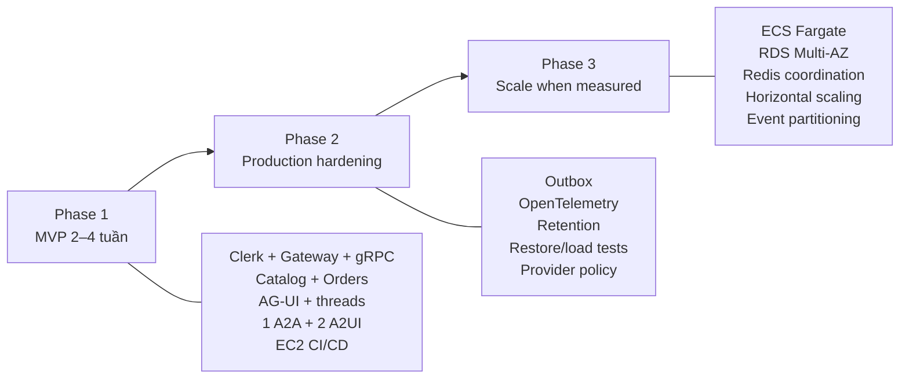

### 18.1. Phase 1 — MVP, 2–4 tuần

#### Tuần 1 — Foundation

- chuẩn hóa monorepo;
- proto code generation;
- Clerk integration;
- Gateway REST skeleton;
- PostgreSQL schemas/migrations;
- PR CI checks.

#### Tuần 2 — Business services

- Catalog CRUD/inventory;
- Order CRUD/status;
- REST↔gRPC mapping;
- tenant isolation và idempotency;
- domain integration tests.

#### Tuần 3 — Agent runtime

- FastAPI + LangGraph;
- AG-UI streaming;
- gRPC read tools;
- thread/run/event store;
- PostgresSaver;
- reload/history.

#### Tuần 4 — Protocol demo và deploy

- Analytics Agent qua A2A;
- KPI report A2UI;
- bulk confirmation A2UI;
- Inngest email/digest;
- Docker images;
- ECR/SSM/EC2 deployment;
- smoke tests và runbook.

Nếu chỉ có hai tuần, hoãn A2UI mutation form và chỉ giữ read-only KPI report;
không bỏ auth, tenant isolation, persistence hoặc CI tests.

### 18.2. Phase 2 — Production hardening

- transactional outbox;
- OpenTelemetry;
- per-org rate/quota;
- checkpoint/event retention;
- provider quota/fallback policy;
- stale-run recovery;
- security/load/restore tests;
- deployment runbook và incident checklist.

### 18.3. Phase 3 — Scale

Chỉ thực hiện khi metrics chứng minh nhu cầu:

- EC2 Compose → ECS Fargate;
- RDS Multi-AZ/read replica;
- Redis distributed lock/pub-sub cho active agent runs;
- resumable streams;
- tách physical database;
- partition/archive `agent_events`;
- independent autoscaling.

Không thêm Kubernetes hoặc service mesh như một bước “trưởng thành” mặc định.

## 19. Trade-off register

| Quyết định               | Lợi ích                   | Chi phí/rủi ro                | Trigger xem xét lại             |
| ------------------------ | ------------------------- | ----------------------------- | ------------------------------- |
| Một Postgres instance    | Rẻ, dễ backup             | Shared blast radius           | DB load/SLA/team ownership      |
| Schema-per-service       | Ownership rõ              | Không isolation bằng instance | Tách service/team/region        |
| Clerk                    | Ship auth nhanh           | Vendor dependency             | Pricing/compliance/custom flow  |
| Gateway verify tập trung | Ít duplicate auth code    | Downstream tin actor context  | Multi-host/zero-trust           |
| AG-UI HTTP exception     | Protocol-native           | Không đồng nhất toàn gRPC     | Có official gRPC client/binding |
| Python agent             | LangGraph ecosystem tốt   | Hai toolchain                 | Team chỉ còn TypeScript         |
| Self-managed threads     | Không Cloud lock-in       | Tự chịu persistence/replay    | Chuyển managed agent platform   |
| EC2 Compose              | Chi phí thấp              | Không HA                      | Traffic/SLA/deploy frequency    |
| Inngest Cloud            | Durable jobs nhanh        | External dependency           | Compliance/cost/offline need    |
| Một A2A sub-agent        | Học protocol có kiểm soát | Thêm deployable/network hop   | Không mang giá trị đo được      |
| A2UI allowlist           | An toàn, UI nhất quán     | Ít tự do hơn arbitrary UI     | Catalog use cases tăng          |

## 20. Definition of done cho kiến trúc MVP

MVP được coi là đạt baseline khi:

- browser chỉ gọi Gateway;
- public REST và AG-UI đều qua auth/rate limit;
- Catalog/Order chỉ nhận gRPC nội bộ;
- không có password trong proto/response;
- tenant isolation có test âm;
- agent không truy cập business database;
- thread tồn tại sau restart;
- mọi AG-UI run có terminal event;
- chỉ có một A2A sub-agent;
- chỉ có tối đa hai A2UI use case;
- confirmed mutation có idempotency;
- Inngest không nằm trên synchronous request path;
- PR chạy test/build đầy đủ;
- main deploy image SHA qua ECR/SSM;
- RDS có backup và restore procedure;
- EC2 chỉ public 80/443.

## 21. Tài liệu tham khảo

### AG-UI và CopilotKit self-managed

- [AG-UI core architecture](https://docs.ag-ui.com/concepts/architecture)
- [AG-UI serialization](https://docs.ag-ui.com/concepts/serialization)
- [AG-UI middleware](https://docs.ag-ui.com/concepts/middleware)
- [AG-UI server quickstart](https://docs.ag-ui.com/quickstart/server)
- [CopilotKit self-managed agents](https://docs.copilotkit.ai/langgraph-typescript/backend/self-managed-agents)

### LangGraph persistence

- [LangGraph persistence overview](https://docs.langchain.com/oss/python/langgraph/persistence)

### A2A

- [A2A specification](https://github.com/a2aproject/A2A/blob/main/docs/specification.md)
- [A2A Python tutorial](https://a2a-protocol.org/latest/tutorials/python/1-introduction/)
- [A2A, MCP and AG-UI roles](https://docs.ag-ui.com/agentic-protocols)

### A2UI

- [A2UI documentation](https://a2ui.org/)
- [A2UI v0.9 specification](https://a2ui.org/specification/v0.9-a2ui/)
- [A2UI transports](https://a2ui.org/concepts/transports/)
- [A2UI React client setup](https://a2ui.org/guides/client-setup/)

### Auth và AWS

- [Clerk manual JWT verification](https://clerk.com/docs/guides/sessions/manual-jwt-verification)
- [Lucia v3 migration/deprecation notice](https://lucia-auth.com/lucia-v3/migrate)
- [Amazon ECS/Fargate pricing model](https://aws.amazon.com/ecs/pricing/)

## 22. Ghi chú triển khai

Tài liệu này là architecture baseline, không phải yêu cầu phải xây mọi future
capability ngay. Khi implementation phát hiện constraint mới:

1. cập nhật quyết định trong tài liệu;
2. ghi rõ trade-off và migration impact;
3. giữ public API/proto backward-compatible nếu có thể;
4. không thêm infrastructure chỉ để “đúng chuẩn enterprise”;
5. ưu tiên một vertical slice chạy end-to-end trước khi mở rộng feature.

# Current implementation note (2026-08-04)

The active repository phase is **Threads-only**. Python LangGraph, A2A and the
CopilotKit Runtime route are intentionally not mounted yet. The implemented
scope is thread CRUD with soft-delete, Prisma/Postgres AG-UI event persistence,
replay/compaction and Redis-ready run coordination. See
`THREAD_MANAGER_IMPLEMENTATION.md` for the executable contract; the AI sections
below describe the planned future integration.
